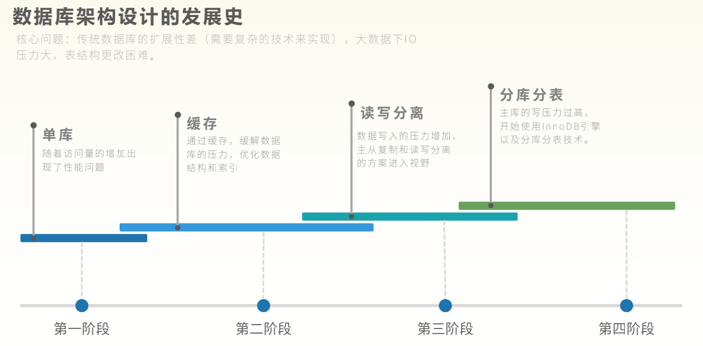
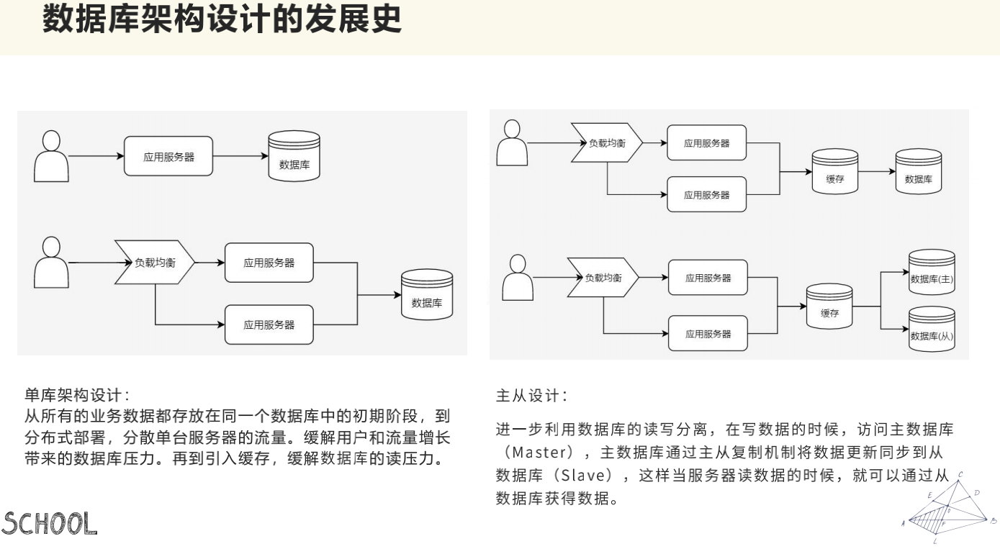
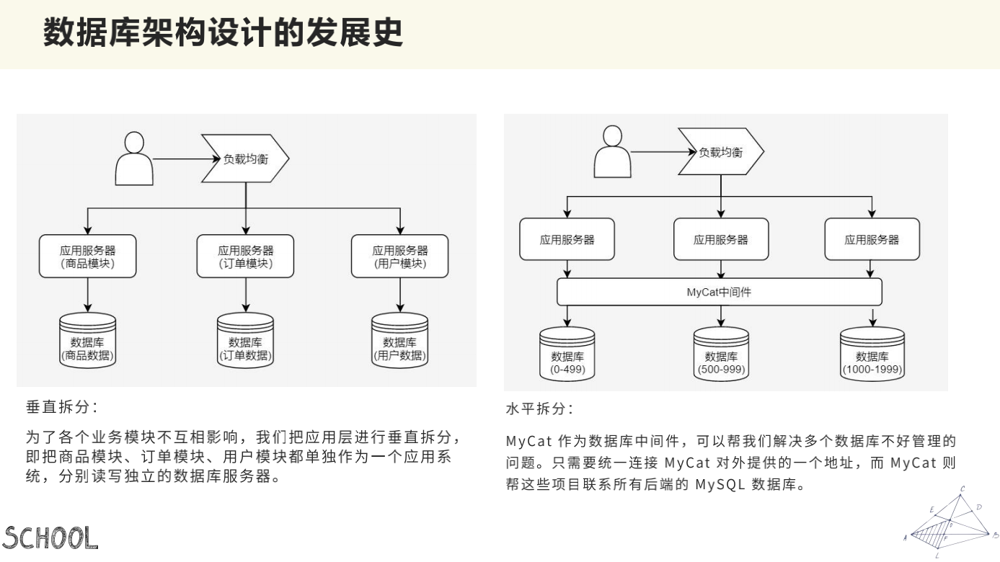
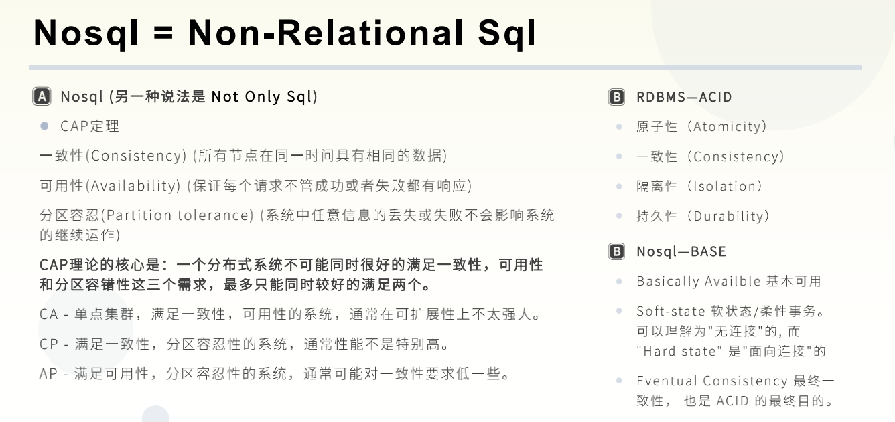
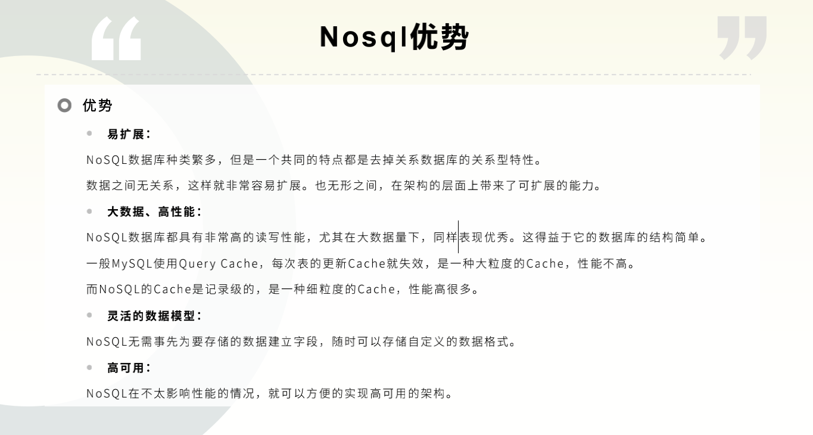
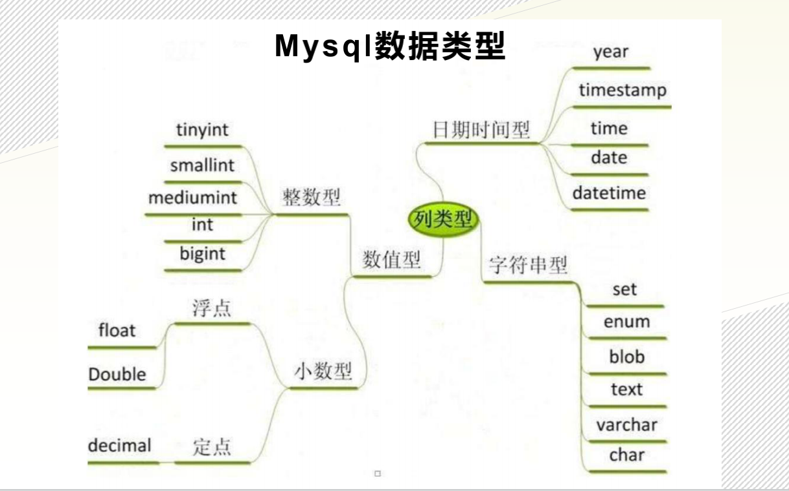
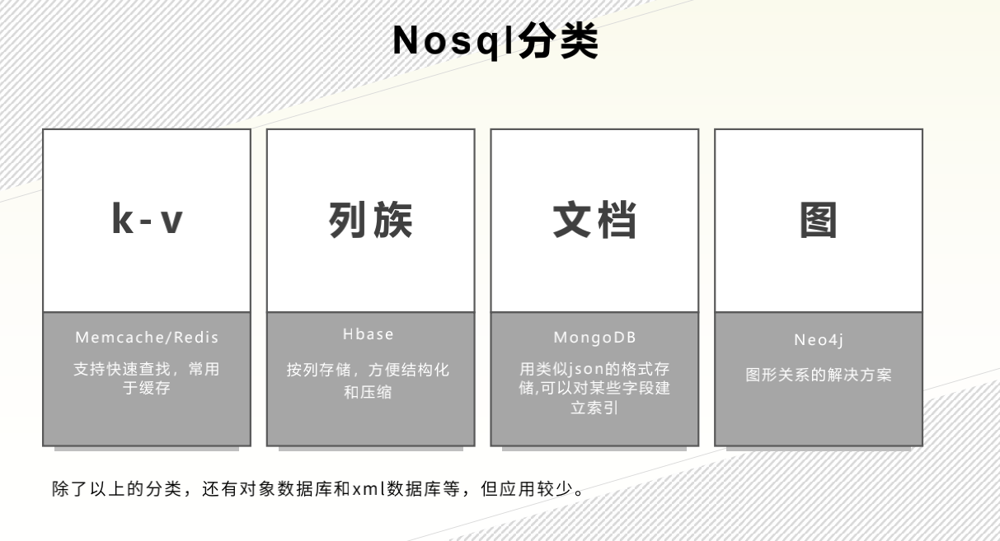

##  01 NoSql初始

### 是谁？ 从哪儿来？Nosql历史

首先我们来看看Nosql的历史（以史为镜，可以知新替换）这样才能知道它以后的发展

#### **从数据库架构设计发展史说起：**

##### **大致分为四个阶段：**

​		互联网在刚刚兴起的时候，还是一个静态的页面，后来动态的页面出现之后，慢慢的互联网变得生动起来。当时一个网站的点击量可能也就在几十兆或者几百兆，这么小的访问量，一个数据库完全可以支撑。
​		随着访问量的增加，我们知道一个网站，最容易出现问题的地方就是数据库，当它的访问量增大，数据库难以支撑的时候，该怎么办呢？就想到了用缓存来解决，我们不直接来查库了，直接写库查库这个IO耗写有些太大了，我们增加一个缓存，比如它五分钟之内的查询都返回缓存中的内容，而不是直接去查库，直接通过内存去解决，就解决了一部分的问题，同时增加缓存的时候还可以去优化这个数据结构，并且优化它的索引，反正就是让查写不那么消耗性能了，让数据库的压力变得小一点。
​		当访问量进步一增长，缓存解决了一部分问题，比如我们现在这个数据库可以解决1000，缓存帮我们解决了900，但是现在访问量是20000，剩下的数据库还是解决不了，要如何去处理呢？这就到了第三阶段，通过读写分离的方式去解决，读和写对于数据库性能的损耗不是一个级别的，读一个数据数据库的压力是小一点的，但是写一个数据数据库的压力是很大的，所以我们能不能让两个数据库来支持一个项目，一个数据库做写，一个数据库做读呢？其实是可以的这就是我们所说的读写分离，我们会主要去写我们的主库，将我们主库的数据同步到我们的从库上，这样我们读的时候就可以直接去读从库了，这样能稍微分离一下我们数据库的负担，这样我们就能去支持更多的并发，更多的流量了。
​		但是随着互联网的发展，我们的流量是与日俱增，比如说双十一，原先不到一亿，但是今天就到了千亿级别了。这是多少倍的增长啊，反应在系统中，就是每秒要承担的并发数是多少的增长，是难以想象的，面对这么大的增长，我们怎么更好的去支持呢？进一步就出现了分库分表的操作，再一次进行分割， 用多个数据库去支持。

##### **数据库架构设计发展史：**

最早的就是左上角的单体的数据库，小人就是用户，用户会先访问服务器，服务器会访问数据库， 数据库把数据传回来之后，用户就能看到自己想要的数据了。用户量增加，也就是并发数增加之后，一个单个服务器已经支持不住它的访问了，就有了通过负载均衡分发服务器的一种形式，这个时候其实一个数据库还是可以支撑的，这个时候的瓶颈主要在于服务器的并发数量上，这个服务器，通过负载均衡，横向扩展n多个都是可以的，也就解决了这个瓶颈。

当服务器越来越多的时候，数据库能承担那么多服务器的访问吗？这是有问题的，这我们就增加缓存来解决，我们知道数据库这磁盘读写的性能消耗太大了，这样就使用缓存也就是内存，将一部分热点数据放在内存中，可以快速的读到，并且不用给我数据库压力了，这样来解决了一部分的问题。由于流量增长的太快了，一个缓存一个数据库也支持不了了，这时候就出现了主从分离，或者说读写分离。把所以的写操作，都放在一个主的数据库上，将这个主数据库的数据同步更新到一个从数据库上，我们读的时候，就是读从库。这就相当于将一个库，扩展为两个库来支持。

但是我们的流量可不是这样，一倍二倍的增长，而是十倍百倍更甚的增长，这个时候两个库也没法很好的支撑了。就有了分库分表。分库分表有分为垂直拆分和水平拆分。垂直拆分：首先用户来，通过负载均衡来访问服务器的时候，各个服务器都是一样的，都可以用来处理不同的模块，现在我们来将它纵向的拆分一下，就是垂直拆分，比如说我们把商品模块拆分成一部分，把订单模块拆成一块单独的，用户模块再拆分成一块单独的，这样数据库就可以拆分成不同模块的数据库。这样我们就可以通过不同的模块，连接不同的模块，用多个数据库来支持这样的大系统，这样我们就从一个数据库，变成两个数据库，变成n个数据库，这样就达到了多个数据库支持一个大项目的目的了。这样有个好处各个模块之间是相互独立的，互不影响的。但也有一个明显的缺点，有多个数据库的维护，多个数据库之间的数据交叉就不太容易实现了。

水平拆分，我们知道两个库没法很好的去支撑，我们用多个库去支撑，多个库我们用编号去拆分，0-499号用户数据放在1号数据库，500-999数据放在2号数据库，这样就水平拆分了，有个中间件MyCat就能很好的实现这个。

但是它们都有自己的弊端：我们已经我们熟悉的新浪微博为例。我们从新浪微博上看，多样化的数据格式，在使用传统的数据库，类似于MySQL这样的，还可以很好的支持吗？即使能够扩容到无限大，但是它能够很好的支持那么多数据的存储和变化吗？这是很难的，我们怎么去存储这种多种数据形态的数据，以及随时在变化的这样一些数据呢？这个时候我们就引入了一种非传统型的数据库，叫做NoSQL。

#### ＮｏＳＱＬ＝Non-Relational Sql

NoSql有两种说法，一种是Non-Relational Sql；另一种是Not Only Sql。
因为非关系型数据库是它的本质，所以我们姑且认为是Non-Relational Sql。

我们看上图，关系型数据库和非关系型数据看的对比，可以看出两种数据库的不同特性要求。

这种非关系型数据库有什么样的特性呢，为什么可以帮助我们解决关系型数据库无法解决的问题呢？先来看一下它的特性：

由于非关系型数据库去掉了关系的特征，去掉了关系的特征，有一个最大的特征，就是非常容易扩展和更改。原来在MySql上，一个人有它的名字，年龄等等一系列的信息，但是如果我们再给这个人增加一些属性值的时候，就需要增加一列，我们能够无限的增加列吗，显然是不能的，MySQL是有自己的列数限制的。而且MySql单表数据量是有限制的，数据量最大是千万级的，当达到千万的时候，它就到达了一个瓶颈，但我们再去插入数据，查询数据的时候，都会遇到慢查询的问题，都是有性能的问题的，这时候，NoSQL就能帮我们解决这个问题，这就是NoSQL的第一大特性，易扩展。

我们知道，我们现在是大数据时代，每天面临海量的数据，我们需要做的是筛选，筛选出有价值的数据给我们自己，我们每个人无论是看朋友圈，还是微博，都是要去筛选，筛选对自己有用的重要的东西留下，那些没用的，不重要的东西，忘掉丢走。NoSQL就更利于大数据量的增删改查，包括它支持的缓存的性能也是高于MySQL的，这边是它的第二大特性，在大数据上的性能更高。

NoSQL没有明确数据类型，所以更加的灵活，可以支持图片，音频等多种多样数据类型的存储。

---

接下来我们首先来看看MySQL的数据类型：

三大类：数值型，日期时间型，字符串型。
timestamp时间戳，当前距离1970年1月1日0时0分0秒的总秒数（格林尼治时间，如果按照北京时间就是8时0分0秒），计算机纪元。1971年贝尔实验室的程序员发明了Unix系统和C语言（jvm底层语言），当时计算机都是32位的，时间跨度支持68年上下，也就是1901-2038年范围内，随着64位系统的诞生，问题就解决了，现在支持2900多亿年。

有了上述的信息之后，我们知道，如果生活中，需要存储数值型可以使用int来存，如果要定位一个时间可以用datetime来存，文本我们可以用可变长字符串varchar来存。但是现在我们还需要存储一些图像，音频，视频，文档，还有一些很大数据量的数据，我们知道MySQL数据库在单表达到千万级的数据量的时候，它的插入查询都会变慢，特别是插入，每插入一条都有可能带来慢查询的性能问题，那么NoSQL是怎么解决的呢？又把数据类型划分成哪些去衍生出它自己的产品呢？

其实，众所周知，k-v格式，就是我们常用的map，这种存储结构最方便的就是查询，根据key可以很快的找到这个value。这种场景更快的去适应缓存这种快速查找的场景。所以k-v形态的产品就Memecache和Redis两种典型产品。这两种典型产品都是在一定历史时期内承担了缓存的解决方案。

MySQL或者说关系型数据库，对于大数据量的存储还是很吃力的，我现在存到1000万，对于单表来说就很辛苦了，如果现在想要1列的数据，MySQL是做不到的，这个时候我们就可以用列族这种数据库去存，列族，它是按照一列一列去存储的，也是有它的主键的，大部分通过JSON的格式存储成一列，像是面包切片，一片一片将其压缩存储的，不过这个面包片的大小可以不一。我们在使用关系型数据库的时候，一般会使用E-R模型来设计关系型数据库。开发过程中很少使用E-R图，关系型数据库的设计其实就是表，那么我们接下来利用表格来继续说明列族存储的形式：

关系型数据库：公司成员系统

示例

| 名字 | 所在部门 | 职位 |
| ---- | -------- | ---- |
| 甜   | 躺吃部   | 白吃 |

设计 members

| 字段名     | 类型         | 备注 |
| ---------- | ------------ | ---- |
| name       | varchar(255) | 名字 |
| department | varchar      | 部门 |
| title      | varchar      | 职位 |

非关系型数据库（JSON类型）

行1：{"name":"甜“, "department":"躺吃部", "title":"白吃"}
现在如果再添加一行数据，但是这行数据需要增加一个列，如果是在关系型数据库上的话，那么需要的就是增加一个列，在非关系型数据库（JSON类型），就不需要增加一个列，导致所有的记录都要增加一个列，而是本身多了一个属性，如：行2：{"name":"甜2“, "department":"躺吃部2", "title":"白吃2", "特征":"傻 "}。
列族，HBase，业内通用的一种解决方案，大数据相关的技术。

第三种，文档。更多的用的是MongoDB，MongoDB可以说是关系型数据库和非关系型数据库的桥梁，有的人还称呼为MySQL++，最接近关系型数据库的非关系型数据库。也是利用类似JSON的格式存储的，还支持索引，更多的是直接存储一个文档。

第四种，图。像是图谱，通过节点和线存储，通过路径去寻找，通过节点去插入。点就表示一个实际的实体，线就表示两个点之间的关系，通过路径就能找到一系列和该节点构成关系的节点。

这四类就已经概括了NoSQL，80%或者90%的应用和解决方案，除了这些之外，还有一个对象数据库和xml数据库，对象数据库实际上就包括了我们对于音频视频这种大对象的存储，我们要对配置文件管理，使用xml数据库就能更加直观的去管理，这两个相对应用较少一点，但是上述四个，相对应用就较多了。

**我们接下来回过头来看我们的 NoSQL = non-relational sql**

NoSQL和传统型拥有ACID的关系型数据库相比，NoSQL作为大数据量的非关系型数据库还是无法满足ACID特性的，但是它也有它本身的一套理论。—— 分布式的理论标准（**CAP定理**）

 我们来具体说一说：分区容错性（分区容忍性），对于一个分布式系统来说，它一般不会部署在一个区，就相当于，部署在，北京一区和杭州二区，现在有个请求过来了，分发给北京一区或者杭州二区，当北京一区的服务挂掉了，杭州二区的服务还是可以使用，这是保证服务高可用的一种方式，这就有了分区的概念。那么分区容错是什么样的呢，就是说，我们对北京一区的通信和对杭州二区的通信，是相互隔离的。通信就有可能出现出错的问题。如果通信出错，是不是就无法保证，北京一区和杭州二区返回的数据是一致的了？有可能在北京区进行了操作，可是在杭州区还没有同步，这就不能一致了。所以说，在保证分区的系统中，一致性，可用性是没有办法同时满足的。现在，我们希望保证北京一区和杭州二区的一致性，北京一区写写操作的时候，杭州二区不可以进行读操作，必须保证北京一区完成之后，杭州二区才能进行读操作，这样的就没有了可用性。如果保证北京一区和杭州二区都可用，那么就丧失了一致性。一致不可用，可用不一致。

现在很多分布式系统，都是保证AP，保证分区和可用的条件下，弱一致性，不是立刻一致性，而是最后是一致的。这就引出了非关系型数据库的ＢＡＳＥ定理。