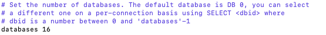

## 02 Redis初识

### Redis ： Remote Dictionary Server 远程字典服务

为什么不叫RDS呢？因为这个名字已经被用了：Relational Database Service （关系型数据服务） 通常别用来指代MySQL。所以别出心裁，拿出了几个字母 Redis。

Redis是一个开源的、使用C语言编写的、支持网络交互的、可基于内存也可持久化的Key-Value数据库（这是Redis不同于Memcache的一点，支持持久化，这就让Redis更加的强大，数据也更加的安全）。

不仅仅支持简单的key-value类型的数据，同时还提供list，set，zset(sorted set)，hash 等数据结构的存储。支持数据的备份（对于数据的保障，除了持久化还有备份，如果服务本身死掉了，机器本身死掉了，那么数据不就丢失了吗，所有备份，很多情况都是用主备模式的备份master-slave），即master-slave模式的数据备份。

Redis是单进程，默认有16个数据库(计数从0开始到15)。

官网给出，每秒可以支持10万次的读写，性能非常强大。

### Redis端口的由来


### Redis的安装

**VirtualBox + Centos7** 
l 安装virtualBox (https : / /www.virtualbox.org/wiki /Downloads ) 
l 导入centos7.ova （已配置好的虚拟机镜像） - 网络是桥接网络
l 启动虚拟机，输入账号和密码(root \123456) 
l 设置网络 获取ip地址 （ifconfig）
l 安装secureCRT（https : / /www.cnblogs .com/yjd_hycf _ space/p/7729796.html）
l 和虚拟机建立连接，修改窗口的编码格式 (Options - Terminal - Appearance - CharacterEncoding - UTF-8) 
l 进入redis安装目录 cd /usr/local/bin
**查找安装路径的方式：**

方式1：


方式2：


版本说明：Redis借鉴了Linux操作系统对于版本号的命名规则，版本号第二位如果是奇数，则为非稳定版本，如果是偶数，则稳定版本。

### Redis的使用

启动redis：`redis-server`，连接需要保持该窗口不关闭，clone窗口，保证IP地址不变，连接到的是当前的服务端。


客户端连接服务端：`redi-cli -p 6379`，指定端口号，并用ping去验证是否连接成功。


通过set设置key1的值为hello world，并通过get取出改key对应的值。


退出的命令：`exit`，表示的是退出该连接，实际上服务还是保持的。
也可以通过客户端，去终止服务：`shutdown`

redis-markbench，压测的命令，测试在不同命令下，10w次请求在多长时间内完成。官方标准是10w/s的get、set


### Redis配置之database 16

【注意】进入Redis的安装路径，将redis.conf先拷贝一份到自己可以找到的地方，然后再对redis.conf进行操作。
1) dataset 16

默认是16个数据库，标号是0-15，默认进入的是0号数据库，可以通过select + id 切换。（我们经常是将具有相同特征的数据放在一个库中，多个数据库协同使用。）
演示：在当前库查看我们插入的key1，切换库，查看没有key。


```apl
1. keys * 查看当前数据库所有的key值，系统会设置3个默认的key，额外使用；
2. select 1 切换到1号数据库，get key，返回nil，表示空的意思，通过127.0.0.1：6379[?]后面的?号值，可以判断当前所在数据库；
3. keys * 的性能很差，所有介绍下面这种匹配方式，	keys ? 匹配，
		对于存在key1， key2， key3形式的key时，keys key? 可以找到
																			 keys k??? 也可以找到
																			 说明?是一个匹配符，并且有占位的作用。
4. dbszie 展示数据库中，key的个数。
5. 如果不想要当前数据库里面的数据了，flushdb，全部清除"慎用"。
6. flushall 删除所有数据库的数据 "要怎么用，看着办"
```

### 键值key操作

```apl
1. exists keyName : 判断keyName是否存在，存在返回（Integer）1，不存在返回（Integer）0
			* 如果keyName存在，现在执行 set keyName "value11"，获取到的值是后设置的值，前一个值被覆盖了。
2. type keyName : 显示当前键值存储的数据类型
```

到这里，我们知道，我们已经能够将数据存储起来了，那么我们要解决的关键问题是缓存，那么缓存什么最重要呢？


```apl
3. expire keyName second : 设置keyName的有效期为second秒。
   ttl keyName : 查看keyName是否过期，返回（Integer）n .
   		如果n>0，代表未过期，n此时表示剩余过期的秒数；
   		如果n=-2，代表这个keyName已经过期了，且keyName已经不存在；
   		如果n=-1，代表没有设置keyName有效期。
4.persist keyName : 设置数据一直有效，特别作用于错误设置了有效期后。
			如果返回（Integer）0，表示，操作失败（原因可能在于该keyName，已经不存在了）
			如果返回（Integer）1，表示，操作成功。
5. del keyName : 删除keyName，返回（Integer）1，表示成功；返回（Integer）0，表示失败。
6. rename keyName1 keyName2 : 将keyName1的名字变更为keyName2，返回OK，表示成功。
7. randomkey : 随机返回一个key。
8. move keyName dbid : 移动指定key到对应的dbid数据库中。
9. expire 和 ttl操作的都是秒级的，但是有时候我们需要精细化我们的时间，使用毫秒级，
	     pexpire keyName milSecond : 设置keyName的有效期为milSecond;
	     pttl keyName : 查看剩余有效期的毫秒数
```

