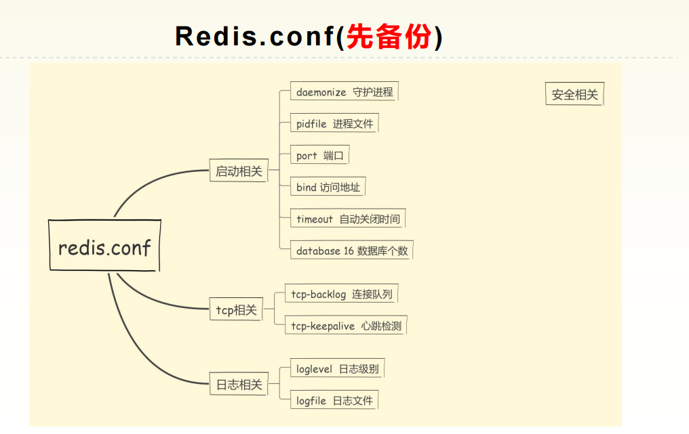

## Redis配置

### 说明

本质上，我们接触的，比如说，主从复制的功能，持久化的功能，它在具体落地的时候都是反应在配置文件上。只不过那些配置相对独立，功能的原理很重要，所以将单独说明。

这里，我们记录的是一些基础配置和一些重要配置。

```apl
配置有的时候是优于代码的，在配置对了的时候，一些代码的问题是可以被容错的，但是如果代码没问题，配置有问题，那是基本上不可能没问题的。配置具有最高优先级。
如果说，前面写完了所有的数据结构，我们知道如何使用任何类型的数据类型去存储它，那么现在了解了这个配置才知道怎么更好的使用这个服务本身。

* 重中之重 ： 因为我们要对操作进行更改，中间可能会出现问题，所以我们先被备份这个配置文件· redis.conf ·
[root@VM-0-10-centos 备份]# mkdir redis-5.0.0
[root@VM-0-10-centos 备份]# cp ~/redis-5.0.0/redis.conf ~/备份/redis-5.0.0/redis.conf
* 这样我们后面的操作都可以操作 ~/备份/redis-5.0.0/下的redis.conf，而不会影响redis本身的操作。
```

### 整体认识redis.conf



### 细节认识redis.conf

#### 1 如何使用redis.conf启动redis-server

```bash
   1 # Redis configuration file example.
   2 #
   3 # Note that in order to read the configuration file, Redis must be
   4 # started with the file path as first argument:
   5 #
   6 # ./redis-server /path/to/redis.conf
```

#### 2 redis单位问题

```bash
   8 # Note on units（单位）: when memory size is needed, it is possible to specify
   9 # it in the usueil form of（通常的形式） 1k 5GB 4M and so forth:
  10 #
  11 # 1k => 1000 bytes （1k 等于 1000  bytes）
  12 # 1kb => 1024 bytes （1kb 等于 1024 bytes）
  13 # 1m => 1000000 bytes
  14 # 1mb => 1024*1024 bytes
  15 # 1g => 1000000000 bytes
  16 # 1gb => 1024*1024*1024 bytes
  17 #
  18 # units are case insensitive（单位的大小写不敏感） so 1GB 1Gb 1gB are all the same.
```

#### 3 引入其他子配置

```bash
  20 ################################## INCLUDES ###################################
  21 
  22 # Include one or more other config files here.  This is useful if you
  23 # have a standard template that goes to all Redis servers but also need
  24 # to customize a few per-server settings.  Include files can include
  25 # other files, so use this wisely.
  26 #
  27 # Notice option "include" won't be rewritten by command "CONFIG REWRITE"
  28 # from admin or Redis Sentinel. Since Redis always uses the last processed
  29 # line as value of a configuration directive, you'd better put includes
  30 # at the beginning of this file to avoid overwriting config change at runtime.
  31 #
  32 # If instead you are interested in using includes to override configuration
  33 # options, it is better to use include as the last line.
  34 #
  35 # include /path/to/local.conf
  36 # include /path/to/other.conf
```

#### 4 Network (网络)配置

##### 4.1 绑定地址

```bash
  53 # Examples:
  54 #
  55 # bind 192.168.1.100 10.0.0.1
  56 # bind 127.0.0.1 ::1
  57 #
  58 # ~~~ WARNING ~~~ If the computer running Redis is directly exposed to the
  59 # internet, binding to all the interfaces is dangerous and will expose the
  60 # instance to everybody on the internet. So by default we uncomment the
  61 # following bind directive, that will force Redis to listen only into
  62 # the IPv4 loopback interface address (this means Redis will be able to
  63 # accept connections only from clients running into the same computer it
  64 # is running).
  65 #
  66 # IF YOU ARE SURE YOU WANT YOUR INSTANCE TO LISTEN TO ALL THE INTERFACES
  67 # JUST COMMENT THE FOLLOWING LINE.
  68 # ~~~~~~~~~~~~~~~~~~~~~~~~~~~~~~~~~~~~~~~~~~~~~~~~~~~~~~~~~~~~~~~~~~~~~~~~
  69 bind 127.0.0.1
* 绑定IP地址（能够访问服务端的地址）
* 当前的redis服务只能被本机访问
```

##### 4.2 保护模式

```bash
  73 # Protected mode is a layer（层） of security protection, in order to avoid that
  74 # Redis instances left open on the internet are accessed and exploited.
  75 # （防止互联网上开放的Redis实例被访问和利用）
  76 # When protected mode is on and if:
  77 #
  78 # 1) The server is not binding explicitly to a set of addresses using the
  79 #    "bind" directive.
  80 # 2) No password is configured.
  81 #
  82 # The server only accepts connections from clients connecting from the
  83 # IPv4 and IPv6 loopback addresses 127.0.0.1 and ::1, and from Unix domain
  84 # sockets.
  85 #
  86 # By default protected mode is enabled. You should disable it only if
  87 # you are sure you want clients from other hosts to connect to Redis
  88 # even if no authentication is configured, nor a specific set of interfaces
  89 # are explicitly listed using the "bind" directive.
  90 protected-mode yes
* 开启保护模式，它会去查看bind是否有配置项，查看redis登录是否有密码。
* 如果bind后面没有配置，且登录也不需要密码，此时就要开启保护模式了，只能让本机去连接。
```

##### 4.3 端口号

```bash
  92 # Accept connections on the specified port, default is 6379 (IANA #815344).
  93 # If port 0 is specified Redis will not listen on a TCP socket.
  94 port 6379
```

##### 4.4 客户端连接超时

```bash
 114 # Close the connection after a client is idle for N seconds (0 to disable)
 115 timeout 0
* 客户端超过timeout配置的时长没有来连接，关闭连接
* 配置0表示不断掉连接
* 单位是秒
```

##### 4.5 服务端对客户端的健康检查

```bash
 117 # TCP keepalive.
 118 #
 119 # If non-zero, use SO_KEEPALIVE to send TCP ACKs to clients in absence
 120 # of communication. This is useful for two reasons:
 121 #
 122 # 1) Detect dead peers.
 123 # 2) Take the connection alive from the point of view of network
 124 #    equipment in the middle.
 125 #
 126 # On Linux, the specified value (in seconds) is the period used to send ACKs.
 127 # Note that to close the connection the double of the time is needed.
 128 # On other kernels the period depends on the kernel configuration.
 129 #
 130 # A reasonable value for this option is 300 seconds, which is the new
 131 # Redis default starting with Redis 3.2.1.
 132 tcp-keepalive 300
* 定时去检查一次客户端是否健康，避免服务端阻塞
* 这里配置300,表示每300秒，检查一次客户端是否健康
```

##### 4.6 tcp连接的队列数量

```bash
  94 # TCP listen() backlog.
  95 #
  96 # In high requests-per-second environments you need an high backlog in order
  97 # to avoid slow clients connections issues. Note that the Linux kernel
  98 # will silently truncate it to the value of /proc/sys/net/core/somaxconn so
  99 # make sure to raise both the value of somaxconn and tcp_max_syn_backlog
 100 # in order to get the desired effect.
 101 tcp-backlog 511
* tcp-backlog表示tcp连接的队列数量(包括，已完成握手和未完成握手的)
* 一般将这个值设置的大一点，以满足那些连接慢的客户端
```

#### 5 通用配置

##### 5.1 后台运行（守护进程）

```bash
 134 # By default Redis does not run as a daemon. Use 'yes' if you need it.
 135 # Note that Redis will write a pid file in /var/run/redis.pid when daemonized.
 136 daemonize no
* 后台运行的开关
* 设置为yes，那么将不会弹出我们看到的redis的一长串banner，也不会占用窗口
* 直接就可以使用当前当前窗口。
* 设置为yes之后，会创建pidfile配置的文件，存储该进程id

 149 # If a pid file is specified, Redis writes it where specified at startup
 150 # and removes it at exit.
 151 #
 152 # When the server runs non daemonized, no pid file is created if none is
 153 # specified in the configuration. When the server is daemonized, the pid file
 154 # is used even if not specified, defaulting to "/var/run/redis.pid".
 155 #
 156 # Creating a pid file is best effort: if Redis is not able to create it
 157 # nothing bad happens, the server will start and run normally.
 158 pidfile /var/run/redis_6379.pid
* 当守护进程开启时，写入进程id的文件
```

##### 5.2 日志级别及日志文件

```bash
 160 # Specify the server verbosity level.
 161 # This can be one of:
 162 # debug (a lot of information, useful for development/testing)
 163 # verbose (many rarely useful info, but not a mess like the debug level)
 164 # notice (moderately verbose, what you want in production probably)
 165 # warning (only very important / critical messages are logged)
 166 loglevel notice
* 四种级别，notice生产环境下使用
* 有日志级别，那么相应的就应该有存储日志的文件
 168 # Specify the log file name. Also the empty string can be used to force
 169 # Redis to log on the standard output. Note that if you use standard
 170 # output for logging but daemonize, logs will be sent to /dev/null
 171 logfile ""
* 默认是标准输出（也就是控制台）
* 如果是守护进程，那么就打印到/dev/null（所以这就能解释为什么我们开启daemonize yes后，日志少了很多）
```

##### 5.3 初始化数据库的数量

```bash
 183 # Set the number of databases. The default database is DB 0, you can select
 184 # a different one on a per-connection basis using SELECT <dbid> where
 185 # dbid is a number between 0 and 'databases'-1
 186 databases 16
* 设置初始化数据库的数量
* 这里设置的是16个
```

---

### 补充(危险命令)

#### 1 config命令的使用及安全校验

```apl
除了通过配置文件查看配置之外，还可以在客户端连接查看配置项，在客户端连接设置配置项。
config命令：
	* config get 配置项
	* config set 配置项
        127.0.0.1:6379> config get port
        1) "port"
        2) "6379"
    	127.0.0.1:6379> 
* 由此我们知道，config还是挺危险的，直接就可以操作配置，但是我们是可以限制使用的。
* 下面是我们设置的安全校验示例：
    127.0.0.1:6379> config get requirepass
    1) "requirepass"
    2) ""
    127.0.0.1:6379> ping
    PONG
    * 查看是否需要密码，并尝试连接测试，此时成功
    
    127.0.0.1:6379> config set requirepass 123456
    OK
    127.0.0.1:6379> ping
    (error) NOAUTH Authentication required.
    * 设置密码123456，再次尝试连接，此时失败
    
    127.0.0.1:6379> auth 123456
    OK
    127.0.0.1:6379> ping
    PONG
    * 通过auth password验证，再次尝试连接，此时成功
    * 恢复初始状态，可以使用：config set requirepass ""
```

#### 2 危险命令的限制（rename-command）

```apl
* 危险命令：
	config 、flushdb 、 flushall 、 keys
* 提供限制的命令：
	rename-command （具体内容，如下配置信息所示）
```

```bash
 494 ################################## SECURITY ###################################
 495 
 496 # Require clients to issue AUTH <PASSWORD> before processing any other
 497 # commands.  This might be useful in environments in which you do not trust
 498 # others with access to the host running redis-server.
 499 #
 500 # This should stay commented out for backward compatibility and because most
 501 # people do not need auth (e.g. they run their own servers).
 502 #
 503 # Warning: since Redis is pretty fast an outside user can try up to
 504 # 150k passwords per second against a good box. This means that you should
 498 # others with access to the host running redis-server.
 499 #
 500 # This should stay commented out for backward compatibility and because most
 501 # people do not need auth (e.g. they run their own servers).
 502 #
 503 # Warning: since Redis is pretty fast an outside user can try up to
 504 # 150k passwords per second against a good box. This means that you should
 505 # use a very strong password otherwise it will be very easy to break.
 506 #
 507 # requirepass foobared
 * 解开注释，设置密码，就相当于: config set requirepass password
 508 
 509 # Command renaming.
 510 #
 511 # It is possible to change the name of dangerous commands in a shared
 512 # environment. For instance the CONFIG command may be renamed into something
 513 # hard to guess so that it will still be available for internal-use tools
 514 # but not available for general clients.
 515 #
 516 # Example:
 517 #
 518 # rename-command CONFIG b840fc02d524045429941cc15f59e41cb7be6c52
 519 #
 520 # It is also possible to completely kill a command by renaming it into
 521 # an empty string:
 522 #
 523 # rename-command CONFIG ""
 * 将rename-command CONFIG 配置为 "" 空字符，config命令不可用
 524 #
 525 # Please note that changing the name of commands that are logged into the
 526 # AOF file or transmitted to replicas may cause problems.
```

```bash
* 配置 ： rename-command CONFIG ""
* 关闭redis进程：
    [root@VM-0-10-centos redis-5.0.0]# ps -ef | grep redis
    root       810 16814  0 15:14 pts/7    00:00:00 src/redis-cli -p 6379
    root      6555 30528  0 15:42 pts/2    00:00:00 grep --color=auto redis
    root     27538     1  0 09:14 ?        00:00:21 src/redis-server *:6379
    [root@VM-0-10-centos redis-5.0.0]# kill -9 27538
* 指定配置文件启动redis服务：
	[root@VM-0-10-centos redis-5.0.0]# /root/redis-5.0.0/src/redis-server /root/备份/redis-5.0.0/redis.conf
* 客户端重新连接，使用config get port，测试config命令是否可用：
    127.0.0.1:6379> exit
    [root@VM-0-10-centos redis-5.0.0]# /root/redis-5.0.0/src/redis-cli -p 6379
    127.0.0.1:6379> config get port
    (error) ERR unknown command `config`, with args beginning with: `get`, `port`, 
* 故限制危险命令的使用通过如下方式：
	* 在配置文件中添加：
		rename-command CONFIG ""
		rename-command FLUSHALL ""
		rename-command FLUSHDB ""
		rename-command KEYS ""
* 除了设置成 ""空串，不可用之外，还可以设置成，一长串别的字符来替代危险命令的关键字
	* 比如 rename-command CONFIG adsknakd90lakdn8u9phjkdalfy89
	* 相当于是加密了该命令，这样就不容易去找到这个命令使用了
```

#### 3 客户端的限制（maxclients）

```bash
 528 ################################### CLIENTS ####################################
 529 
 530 # Set the max number of connected clients at the same time. By default
 531 # this limit is set to 10000 clients, however if the Redis server is not
 532 # able to configure the process file limit to allow for the specified limit
 533 # the max number of allowed clients is set to the current file limit
 534 # minus 32 (as Redis reserves a few file descriptors for internal uses).
 535 #
 536 # Once the limit is reached Redis will close all the new connections sending
 537 # an error 'max number of clients reached'.
 538 #
 539 # maxclients 10000
* 如果maxclients没有设置，那么表示不限制多少客户端去连接。
* 最好设置一下，这样可以保证并发数
```

#### 4 内存使用的限制（maxmemory）

```bash
 543 # Set a memory usage limit to the specified amount of bytes.
 544 # When the memory limit is reached Redis will try to remove keys
 545 # according to the eviction policy selected (see maxmemory-policy).
 546 #
 547 # If Redis can't remove keys according to the policy, or if the policy is
 548 # set to 'noeviction', Redis will start to reply with errors to commands
 549 # that would use more memory, like SET, LPUSH, and so on, and will continue
 550 # to reply to read-only commands like GET.
 551 #
 552 # This option is usually useful when using Redis as an LRU or LFU cache, or to
 553 # set a hard memory limit for an instance (using the 'noeviction' policy).
 554 #
 555 # WARNING: If you have replicas attached to an instance with maxmemory on,
 556 # the size of the output buffers needed to feed the replicas are subtracted
 557 # from the used memory count, so that network problems / resyncs will
 558 # not trigger a loop where keys are evicted, and in turn the output
 559 # buffer of replicas is full with DELs of keys evicted triggering the deletion
 560 # of more keys, and so forth until the database is completely emptied.
 561 #
 562 # In short... if you have replicas attached it is suggested that you set a lower
 563 # limit for maxmemory so that there is some free RAM on the system for replica
 564 # output buffers (but this is not needed if the policy is 'noeviction').
 565 #
 566 # maxmemory <bytes>
* maxmemory设置最大内存，当我们已经将一些数据存在redis中，每次启动redis都会读取数据，加载到内存中，这时我们要判断有没有达到最大内存。如果达到最大内存需要清理一些数据，这就涉及到了redis的缓存清理策略。
* 我们先来看看其他缓存中使用的清理策略（或者说淘汰策略）
```

##### 1 其他缓存中的淘汰策略

```
* 什么时候需要使用过期/淘汰策略：
	* 有效期到：
		* 有效期叫做 TTL （Time to live) 设置有效期的作用：
		* 节省空间和数据弱一致性——有效期失效后保证数据的一致性
	* 内存使用达到最大值：
		* 过期/淘汰策略： 当内存使用达到最大值时，需要使用某种算法来决定清理掉哪些数据，
		* 以保证新数据的存入。
		
* 业界常用的对于缓存淘汰的三种方式：
FIFO ：First In First Out， 先进先出。
判断被存储的时间，离目前最远的数据优先被淘汰。
但是如果我一个月前存储的数据我每天都在用，我一周前存储的数据用了一次就不用了，
显然，淘汰我一个月前存的数据是不合理的，所以就有了LRU。

LRU ：Least Recently Used，最近最少使用。判断最近被使用的时间，目前最远的数据优先被淘汰。
还有一种和LRU，很容易搞混的的处理方式
LFU ：Least Frequently Used， 最不经常使用。在一段时间内， 数据被使用次数最少的，优先被淘汰。

对于LRU来说，我们每次使用数据的时候，都记录一下该数据的使用时间，在淘汰的时候，就比较距离当前时间最远的。说明这个数据近期没有被用。LRU记录的是最近被使用的时间。
而LFU记录的是最近被使用的次数，假如10天，记录十天范围内，使用该数据的次数，去淘汰使用次数少的数据。
```

##### 2 Redis的缓存淘汰策略

```apl
volatile（不稳定的），代表会过期的数据，等价于设置了expire的数据。
六种策略：
* noeviction: 不删除策略, 达到最大内存限制时, 如果需要更多内存, 直接返回错误信息。 大多数写 命令都会导致占用更多的内存(有极少数会例外, 如 DEL )。 

* allkeys-lru: 所有key通用; 优先删除最近最少使用(less recently used ,LRU) 的 key。 

* volatile-lru: 优先删除最近最少使用(less recently used ,LRU) 的 key(限于会过期的key)。 

* allkeys-random: 所有key通用; 随机删除一部分 key。 

* volatile-random: 随机删除一部分 key(限于会过期的key)。 

* volatile-ttl: 优先删除剩余时间(time to live,TTL) 短的key(限于会过期的key)。

Redis缓存淘汰策略 如果分为热数据与冷数据, 推荐使用 allkeys-lru 策略。
```

##### 3 近似LRU算法

```asciiarmor
因为LRU算法需要消耗大量内存，所采用近似LRU算法，并且是懒处理。 
算法原理：（使用随机采样法淘汰元素） 首先给每个key增加一个额外24bit的字段，记录最后被访问的时间戳。
然后当内存超出maxmemory时，随机采样出5个key（通过maxmemory_samples设置），
采样范围取决于是allkeys还是volatile，淘汰掉最旧的key，如果仍然超出，继续采样淘汰。 
算法分析： 采样范围越大，越接近严格LRU，Redis3.0中增加了淘汰池，进一步提升了效果。 
淘汰池是一个大小为maxmemory_samples的数组，每一次淘汰循环中，新随机出的key会和淘汰池 中的key列表融合，淘汰掉最旧的key，剩余较旧的key列表放在淘汰池中等待下一次循环。
```

##### 4 淘汰策略和淘汰池的配置

```bash
 568 # MAXMEMORY POLICY: how Redis will select what to remove when maxmemory
 569 # is reached. You can select among five behaviors:
 570 #
 571 # volatile-lru -> Evict using approximated LRU among the keys with an expire set.
 572 # allkeys-lru -> Evict any key using approximated LRU.
 573 # volatile-lfu -> Evict using approximated LFU among the keys with an expire set.
 574 # allkeys-lfu -> Evict any key using approximated LFU.
 575 # volatile-random -> Remove a random key among the ones with an expire set.
 576 # allkeys-random -> Remove a random key, any key.
 577 # volatile-ttl -> Remove the key with the nearest expire time (minor TTL)
 578 # noeviction -> Don't evict anything, just return an error on write operations.
 579 #
 580 # LRU means Least Recently Used
 581 # LFU means Least Frequently Used
 582 #
 583 # Both LRU, LFU and volatile-ttl are implemented using approximated
 584 # randomized algorithms.
 585 #
 586 # Note: with any of the above policies, Redis will return an error on write
 587 #       operations, when there are no suitable keys for eviction.
 588 #
 589 #       At the date of writing these commands are: set setnx setex append
 590 #       incr decr rpush lpush rpushx lpushx linsert lset rpoplpush sadd
 591 #       sinter sinterstore sunion sunionstore sdiff sdiffstore zadd zincrby
 592 #       zunionstore zinterstore hset hsetnx hmset hincrby incrby decrby
 593 #       getset mset msetnx exec sort
 594 #
 595 # The default is:
 596 #
 597 # maxmemory-policy noeviction
* 默认的是noeviction，解开注释即可
 598 
 599 # LRU, LFU and minimal TTL algorithms are not precise algorithms but approximated
 600 # algorithms (in order to save memory), so you can tune it for speed or
 601 # accuracy. For default Redis will check five keys and pick the one that was
 602 # used less recently, you can change the sample size using the following
 603 # configuration directive.
 604 #
 605 # The default of 5 produces good enough results. 10 Approximates very closely
 606 # true LRU but costs more CPU. 3 is faster but not very accurate.
 607 #
 608 # maxmemory-samples 5
* 设置淘汰池的大小，解开注释即可
```


