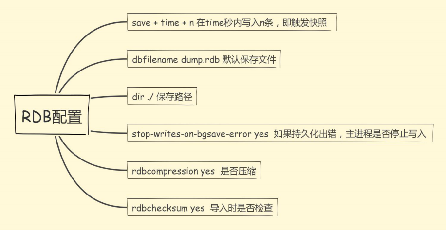
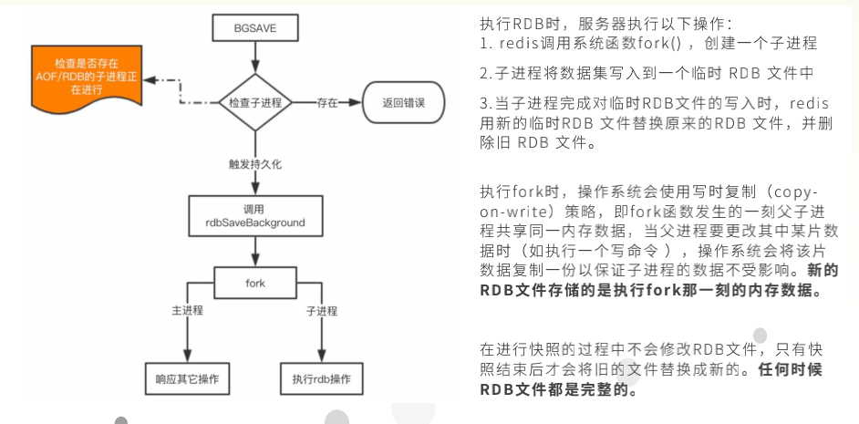

#### Redis持久化之RDB

```asciiarmor
Redis重大特性之一：持久化，PK掉memcache的一大法宝。 
为什么持久化那么重要呢？我们在读取操作的时候，都是在内存中进行操作的，但是万一某个时刻，我们的连接断开了或者Redis本身的服务退出了，此时如果这个数据不存在了，可能就严重影响生产环境上的业务。
比如说，本来好好的存储了一部分数据，可以让用户快速获得，但是突然没有了，它要都去数据库中存，这个时候数据库中的压力，重则将数据库打垮，整个服务不可用，这是灾难性的。这是一种，不使用它存储数据，而是只把Redis数据当做缓存来使用。
再比如说，我们将一些关键数据存储到Redis中，因为某些原因，Redis服务宕机了、重启了，或者Redis所在机器宕机了、重启了，导致数据丢失了，那么用户发现，我刚刚做的一些操作没有生效，影响了用户对我们的信任，如果是金融方面的业务，那么用户不可能再用我们了，因为金融涉及到钱，我都不信任你了，怎么会把钱放在你那？信任是用户愿意使用我们产品的基石。所以，数据也是我们设计系统的重中之重。
我们让数据以持久化（存储到硬盘中），去防止不可抗因素，让数据可追溯。
---
持久化——将数据（如内存中的对象）保存到可永久保存的存储设备中。
```

### Redis支持的两种持久化方式

```apl
方式一，RDB：在指定的时间间隔内对数据进行快照存储。先将数据集写入临时文件，写入成功后， 再替换之前的文件，用二进制压缩存储，是一次的全量备份。
* RDB实际上是一种快照形式的存储（快照可以理解成，把当前时刻的数据拍成一张照片保存下来）;
* 将指定时间间隔时间内的数据存储起来，存储为一个 .rdb 的文件（默认的文件名为dump.rdb）；
* 然后使用该文件，替换原先的备份文件，保证在一定时间间隔内，数据备份是最新的，全量的。

方式二，AOF：以日志文本的形式记录服务器所处理的每一个数据更改指令，然后通过重放来恢复数据，是连续的增量备份。

从四个方面去了解上述持久化方式：
	* 1. 持久化的触发和配置 
	* 2. 持久化后恢复数据的方式 
	* 3. 持久化的工作原理 
	* 4. 关于性能与实践建议
```

### RDB触发和恢复 (Redis DataBase)

```apl
在指定的时间间隔内对数据进行快照存储，可以通过命令触发 或者 自动触发。 
---
命令触发： 
  1. save，会阻塞当前Redis服务器，直到持久化完成，线上应该禁止使用。 
  2. bgsave，该触发方式会fork一个子进程，由子进程负责持久化过程，因此阻塞只会发生在fork子进程的时候。 
   [补充：]（
       * 一个进程，包括代码、数据和分配给进程的资源。fork（）函数通过系统调用创建一个与原来进程几乎完全相同的进程，也就是两个进程可以做完全相同的事，但如果初始参数或者传入的变量不同，两个进程也可以做不同的事。一个进程调用fork（）函数后，系统先给新的进程分配资源，例如存储数据和代码的空间。然后把原来的进程的所有值都复制到新的新进程中，只有少数值与原来的进程的值不同。相当于克隆了一个自己。
       * fork调用的一个奇妙之处就是它仅仅被调用一次，却能够返回两次，它可能有三种不同的返回值：
         1）在父进程中，fork返回新创建子进程的进程ID；
         2）在子进程中，fork返回0；
         3）如果出现错误，fork返回一个负值；
       * 在fork函数执行完毕后，如果创建新进程成功，则出现两个进程，一个是子进程，一个是父进程。在子进程中，fork函数返回0，在父进程中，fork返回新创建子进程的进程ID。我们可以通过fork返回的值来判断当前进程是子进程还是父进程。
   ）
---

自动触发： 
  1. 根据我们的 save m n 配置规则自动触发； [详情见redis.conf]
  	[补充：] （
  	 198 # Save the DB on disk:
     199 #
     200 #   save <seconds> <changes>
     201 #
     202 #   Will save the DB if both the given number of seconds and the given
     203 #   number of write operations against the DB occurred.
     204 #
     205 #   In the example below the behaviour will be to save:
     206 #   after 900 sec (15 min) if at least 1 key changed
     207 #   after 300 sec (5 min) if at least 10 keys changed
     208 #   after 60 sec if at least 10000 keys changed
     209 #
     210 #   Note: you can disable saving completely by commenting out all "save" lines.
     211 #
     212 #   It is also possible to remove all the previously configured save
     213 #   points by adding a save directive with a single empty string argument
     214 #   like in the following example:
     215 #
     216 #   save ""
     217 
     218 save 900 1       # 在900秒内改变一次就会触发一次备份
     219 save 300 10      # 在300秒内改变10次就会触发一次备份
     220 save 60 10000    # 在60秒内改变10000次就会触发一次备份
  	）
  2. 从节点全量复制时，主节点发送rdb文件给从节点完成复制操作，主节点会触发 bgsave； 
  3. 执行 debug reload 时； 
  4. 执行 shutdown时，如果没有开启aof（持久化方式），也会触发。 

恢复方式：将备份文件（dump.rdb）移动到redis安装目录并启动服务即可
在每次启动的时候都会去读取该文件，将其加载到内存中，这样就相当于是恢复数据了。
```

#### RDB在redis.conf中的配置 



```apl
 252 # The filename where to dump the DB
 253 dbfilename dump.rdb
 
 255 # The working directory.
 256 #
 257 # The DB will be written inside this directory, with the filename specified
 258 # above using the 'dbfilename' configuration directive.
 259 #
 260 # The Append Only File will also be created inside this directory.
 261 #
 262 # Note that you must specify a directory here, not a file name.
 263 dir ./
 
 222 # By default Redis will stop accepting writes if RDB snapshots are enabled
 223 # (at least one save point) and the latest background save failed.
 224 # This will make the user aware (in a hard way) that data is not persisting
 225 # on disk properly, otherwise chances are that no one will notice and some
 226 # disaster will happen.
 227 #
 228 # If the background saving process will start working again Redis will
 229 # automatically allow writes again.
 230 #
 231 # However if you have setup your proper monitoring of the Redis server
 232 # and persistence, you may want to disable this feature so that Redis will
 233 # continue to work as usual even if there are problems with disk,
 234 # permissions, and so forth.
 235 stop-writes-on-bgsave-error yes  # bgsave出错会停止写入，卡住等待处理。
 
 237 # Compress string objects using LZF when dump .rdb databases?
 238 # For default that's set to 'yes' as it's almost always a win.
 239 # If you want to save some CPU in the saving child set it to 'no' but
 240 # the dataset will likely be bigger if you have compressible values or keys.
 241 rdbcompression yes  # 保存快照的时候是否要压缩
 
  243 # Since version 5 of RDB a CRC64 checksum is placed at the end of the file.
 244 # This makes the format more resistant to corruption but there is a performance
 245 # hit to pay (around 10%) when saving and loading RDB files, so you can disable it
 246 # for maximum performances.
 247 #
 248 # RDB files created with checksum disabled have a checksum of zero that will
 249 # tell the loading code to skip the check.
 250 rdbchecksum yes # 导入的时候是否检查，当然要检查rdb文件的可用性和健康性
```

#### RDB-Fork原理（bgsave）



#### RDB性能分析

#####  **优点** 

通过rdb文件恢复数据比较快。 l 
rdb文件非常紧凑，适合于数据备份。 l 
通过RDB进行数据备份，由于使用 子进程生成，所以对Redis服务器性 能影响较小  l 

#####  **缺点** 

采用RDB的方式可能会造成某个时段内数据的丢失，比如还没达到 触发条件时服务器死机了，那么这个时间段的数据会丢失。 l 
使用save命令会造成服务器阻塞，直接数据同步完成才能接收后 续请求。 l 
使用bgsave命令在forks子进程时，如果数据量太大，forks的过 程也会发生阻塞，另外，forks子进程会耗费内存 

####  RDB相关命令

未执行触发备份前：


手动触发：save，查看时间变化


手动触发：bgsave，查看时间变化


##### 示例

删除所有的key，然后通过dump.rdb恢复

```apl
* 从上图我们知道，当前目录下有，dump.rdb
* 1. 备份dump.rdb(或者说，重命名dump.rdb) :
        mv dump.rdb dump.rdb.old
        将dump.rdb重命名为dump.rdb.old,看似是重命名，实际上相当于是转移了文件，即备份了。
        在执行flushall的时候，会生成dump.rdb,重命名可以防止文件替换。
* 2. 查看现在的keys，清除所有的keys:
        keys *
        flushall
* 3. 执行flushall的时候，会生成dump.rdb文件。但是保存这个文件的时候，我们已经将keys全部清除了，所以保存这个dump.rdb是空，保存这个文件也没什么意义。

* 4. 我们这次操作是误操作，我们现在要对恢复我们操作之前的数据：
		 4.1 关机:在客户端执行这两条命令，shutdown —— exit
     4.2 删除新生成的dump.rdb:rm -rf dump.rdb
     4.3 将dump.rdb.old重新命名为dump.rdb:mv dump.rdb.old dump.rdb
     4.4 重新通过配置文件启动服务端（配置文件最好写全路径）:redis-server /root/备份/redis-5.0.0/redis.conf
     4.5 重新连接客户端，通过keys * 查看当前的key，发现恢复到了我们最初的样子。   
```

