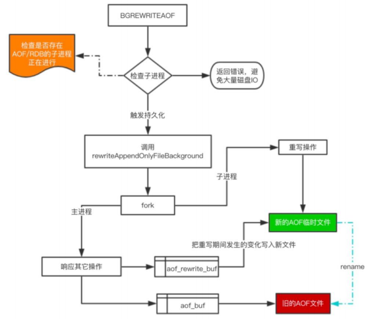

## 持久化之AOF

```abap
提出一个问题， 
	设置key1=10，即set key1 10；
	做自增一次，即incr key1; 
	做数值操作增加5，即incrby key1 5,
	问，key1的值是多少？ 10 + 1 + 5 = 16.
	对数据更新的操作都称为写操作，那么只要将所有的写操作都存储下来， 那么是不是可以推倒出key1结果？
	可以此时记录的变更数是 3 次。
如果此时，key1自增5次，那么就要记录7次变更操作，这是不是太多了？那么有没有什么可以优化的地方呢？
将， 5次incr 优化成 1次 incrby 5 即可。
此时，key1的结果依旧记录下来了，但是变更操作从7次变为了3次。 
--->上述便是aof生效的核心原理（本质上是记录每一次变更结果，记录之后可能记录数量非常的多，会有压缩或者转变它存储的过程，但是做种的结果保持不变。）
```

### AOF（Append Only File）

```apl
以日志的形式记录服务器所处理的每一个更改操作，
但操作过多，aof文件过大时，加载文件恢复数据会非常慢，为解决这个问题，Redis支持aof文件重写，通过重写aof，可以生成一个恢复当前数据的最少命令集。 
所以整个流程大体分为两步，
    一是命令的实时写入，
    二是对aof文件的重写。 
命令写入流程： 命令写入 -> 追加到aof_buf -> 同步到aof磁盘 (考虑到磁盘IO心性能增加了缓冲) 
其中，aof重写可以手动或者自动触发。 
    命令触发：bgrewriteaof 
    自动触发：根据配置规则来触发 (整体时间还跟Redis的定时任务频率有关系) 在写入aof日志文件时，如果redis服务器宕机，则日志文件会出格式错误，重启服务器时，服务器会拒绝载入这个aof文件，此时可以通过以下命令修复aof并恢复数据。 redis -check-aof -fix file.aof
```

###   AOF配置

```apl
 693 # AOF and RDB persistence can be enabled at the same time without problems.
 694 # If the AOF is enabled on startup Redis will load the AOF, that is the file
 695 # with the better durability guarantees.
 696 #
 697 # Please check http://redis.io/topics/persistence for more information.
 698 
 699 appendonly no
* 表明aof的开关默认是关闭的。在默认的配置中使用的是rdb，那么如果两个同时开启会有问题吗？
* 可以共用
 701 # The name of the append only file (default: "appendonly.aof")
 702 
 703 appendfilename "appendonly.aof"
 * 开启后，默认将日志写在 appendonly.aof 文件中
```

### 演示效果

`此时并没有appendonly.aof`


`使用配置文件开启redis-server`


`手动触发aof`


### AOF配置思维导图


#### 写入方式appendfsync

```apl
 705 # The fsync() call tells the Operating System to actually write data on disk
 706 # instead of waiting for more data in the output buffer. Some OS will really flush
 707 # data on disk, some other OS will just try to do it ASAP.
 708 #
 709 # Redis supports three different modes:
 710 #
 711 # no: don't fsync, just let the OS flush the data when it wants. Faster.
 * 服务器不负责什么时候写入，而是由操作系统决定什么时候写入数据，很快，也很不安全， 一般不建议使用，一个事情如果不能由我们自己主导是不是就很不安全呀。
 712 # always: fsync after every write to the append only log. Slow, Safest.
 * 每一次有写操作都将其写入append only日志，慢（过来一条命令就写一条，很占IO性能）但是最安全
 713 # everysec: fsync only one time every second. Compromise.
 * 每秒钟写入一次aof（最坏情况是上一秒种刚写完，断电了，这个时候就丢失了一秒以内的数据。这个还是可以接受的）—— 适中的。
 714 #
 715 # The default is "everysec", as that's usually the right compromise between
 716 # speed and data safety. It's up to you to understand if you can relax this to
 717 # "no" that will let the operating system flush the output buffer when
 718 # it wants, for better performances (but if you can live with the idea of
 719 # some data loss consider the default persistence mode that's snapshotting),
 720 # or on the contrary, use "always" that's very slow but a bit safer than
 721 # everysec.
 722 #
 723 # More details please check the following article:
 724 # http://antirez.com/post/redis-persistence-demystified.html
 725 #
 726 # If unsure, use "everysec".
 727 
 728 # appendfsync always
 729 appendfsync everysec   # 默认的
 730 # appendfsync no
```

#### 重写方式

```apl
* 除了将命令写入aof（appendonly.aof），还有一个很重要的过程 —— 重写。
* 重写的目的，是为了让aof文件尽量的小一点。

 732 # When the AOF fsync policy is set to always or everysec, and a background
 733 # saving process (a background save or AOF log background rewriting) is
 734 # performing a lot of I/O against the disk, in some Linux configurations
 735 # Redis may block too long on the fsync() call. Note that there is no fix for
 736 # this currently, as even performing fsync in a different thread will block
 737 # our synchronous write(2) call.
 738 #
 739 # In order to mitigate this problem it's possible to use the following option
 740 # that will prevent fsync() from being called in the main process while a
 741 # BGSAVE or BGREWRITEAOF is in progress.
 742 #
 743 # This means that while another child is saving, the durability of Redis is
 744 # the same as "appendfsync none". In practical terms, this means that it is
 745 # possible to lose up to 30 seconds of log in the worst scenario (with the
 746 # default Linux settings).
 747 #
 748 # If you have latency problems turn this to "yes". Otherwise leave it as
 749 # "no" that is the safest pick from the point of view of durability.
 750 
 751 no-appendfsync-on-rewrite no   
 * 在重写期间是否同步，也就是说，在重写的时候，是否对新过来的写操作进行同步。默认是不同步的。这样就可以等重写完成之后，再处理新进来的写操作。这样能够尽量的提升一部分性能。
```

####  重写触发配置

```apl
对于aof重写的触发，不仅可以通过命令触发，还可以通过配置文件触发。

 753 # Automatic rewrite of the append only file.
 754 # Redis is able to automatically rewrite the log file implicitly calling
 755 # BGREWRITEAOF when the AOF log size grows by the specified percentage.
 756 #
 757 # This is how it works: Redis remembers the size of the AOF file after the
 758 # latest rewrite (if no rewrite has happened since the restart, the size of
 759 # the AOF at startup is used).
 * Redis会记录距离当前最近的，重写的aof文件的大小。然后比较，现在aof文件的大小，是否超过上次aof重写的文件的大小。如果超过了，超过了多少。如果超过了100%，那么就会进行重写。（也就是，现在重写文件的大小是上次的二倍，那么就会触发重写。  ）
 760 #
 761 # This base size is compared to the current size. If the current size is
 762 # bigger than the specified percentage, the rewrite is triggered. Also
 763 # you need to specify a minimal size for the AOF file to be rewritten, this
 764 # is useful to avoid rewriting the AOF file even if the percentage increase
 765 # is reached but it is still pretty small.
 766 #
 767 # Specify a percentage of zero in order to disable the automatic AOF
 768 # rewrite feature.
 769 
 770 auto-aof-rewrite-percentage 100
 771 auto-aof-rewrite-min-size 64mb
 * 允许重写的最小aof文件的大小。也就是说，如果现在超过了2倍，但是还没有超过64M，那么这个时候不重写，一定要等到64M以上去重写，以避免文件太小，达到了百分比去频繁的重写。
```

#### 加载aof文件出错的处理方式

```apl
* aof这个文件本身是有可能不完整的，当我们在备份过程中，出现一些意外的时候，那么aof文件可能写一半，这个时候这个文件就是有问题的。在Redis启动的时候，会将aof文件加载到内存中，然后发现这个文件是有问题的，怎么办？
* 处理方式，取决于这个配置项：
* yes：尽可能多的加载aof中的数据，知道加载到某些错误的日志时，不继续加载。
* no：不加载，快速失败。需要我们手动修改这个aof文件了。
手动修复说明如下：
	在写入aof日志文件时，如果redis服务器宕机，则日志文件会出格式错误，重启服务器时，服务器会拒绝载入这个aßof文件，此时可以通过该命令修复aof并恢复数据。 redis -check-aof -fix file.aof
 
 773 # An AOF file may be found to be truncated at the end during the Redis
 774 # startup process, when the AOF data gets loaded back into memory.
 775 # This may happen when the system where Redis is running
 776 # crashes, especially when an ext4 filesystem is mounted without the
 777 # data=ordered option (however this can't happen when Redis itself
 778 # crashes or aborts but the operating system still works correctly).
 779 #
 780 # Redis can either exit with an error when this happens, or load as much
 781 # data as possible (the default now) and start if the AOF file is found
 782 # to be truncated at the end. The following option controls this behavior.
 783 #
 784 # If aof-load-truncated is set to yes, a truncated AOF file is loaded and
 785 # the Redis server starts emitting a log to inform the user of the event.
 786 # Otherwise if the option is set to no, the server aborts with an error
 787 # and refuses to start. When the option is set to no, the user requires
 788 # to fix the AOF file using the "redis-check-aof" utility before to restart
 789 # the server.
 790 #
 791 # Note that if the AOF file will be found to be corrupted in the middle
 792 # the server will still exit with an error. This option only applies when
 793 # Redis will try to read more data from the AOF file but not enough bytes
 794 # will be found.
 795 aof-load-truncated yes
```

#### 混合持久化模式是否开启

```apl
* 新的配置项，Redis 4.0 以前是看不到的。
* rdb和aof的混合持久化模式。开启了混合持久化之后，aof产生的重写文件同时包含rdb格式的内容和aof格式的内容。rdb格式的内容会记录已经有的数据，而aof格式的内容会记录最新发生的变化的数据。这样Redis就可以同时有rdb持久化和aof持久化的优点了。
 
 797 # When rewriting the AOF file, Redis is able to use an RDB preamble in the
 798 # AOF file for faster rewrites and recoveries. When this option is turned
 799 # on the rewritten AOF file is composed of two different stanzas:
 800 #
 801 #   [RDB file][AOF tail]
 802 #
 803 # When loading Redis recognizes that the AOF file starts with the "REDIS"
 804 # string and loads the prefixed RDB file, and continues loading the AOF
 805 # tail.
 806 aof-use-rdb-preamble yes
```

### AOF原理



```apl
* 我们输入bgrewriteaof命令后，发生了什么？
* 检查当前的子进程是否在进行，如果没有，那么触发一次持久化。 这个持久化的触发，也会触发到fork函数中，fork函数会从主进程中，新建一个子进程出来。子进程就是进行重写操作。而主进程还是进行响应其他的读写操作。
* 真正在重写的时候，会新建一份aof临时文件，然后将重写过程中发生的变化也写入到这个新的aof临时文件中，直到写完，写完之后，会将这个文件重命名为旧的aof文件，覆盖原先的aof文件，以保证只有一份aof文件。
---
* 在重写期间，主进程依然在响应命令， 为了保证最终备份的完整性，因此数据不仅新的AOF临时文件中，而且也写入旧的AOF file中，如果重写失败，能够保证数据不丢失。 
* 为了把重写期间响应的写入信息也写入到新的文件中，因此也会为子进程保留一个buf，防止新写的file丢失数据。 
* 重写的本质：重写是直接把当前内存的数据生成对应命令，并不需要读取老的AOF文件进行分析、命令合并。 
* AOF文件直接采用的文本协议，主要是兼容性好、追加方便、可读性高、可人为修改修复
---
AOF的原理本质上就是：有子进程和主进程。在不影响主进程处理其他的读写操作的时候，有一个子进程，一直在重写文件。而重写的逻辑是，与其进行命令的分析、合并，倒不如直接拿到这些命令执行完的值，直接set key value，一条命令，便解决了前面的所有操作了，是最简化的一种压缩方式。然后，重写完的aof文件，就形如一个文本文件，我们可以直接查看。
```

### AOF性能分析

```apl
 优点 
* AOF只是追加日志文件，因此对服务器性能影响较小，速度比RDB要快，消耗的内存较少。 
* 数据安全性较高。

 缺点 
* AOF方式生成的日志文件太大，即使通过AFO重写，文件体积仍然很大。 
* 恢复数据的速度比RDB慢。

当RDB与AOF两种方式都开启时，Redis启动时会优先使用AOF日志来恢复数据，因为AOF保存的文件比RDB文件更完整。
Redis 4.0提供了一个混合持久化的选择，将rdb文件的内容和增量的aof 日志存在一起，重启时先加载rdb，再重放aof，以达到最大效率。
```

