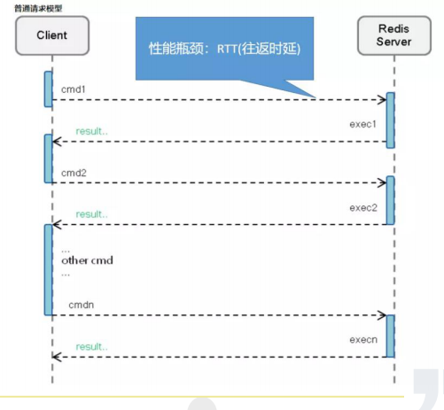
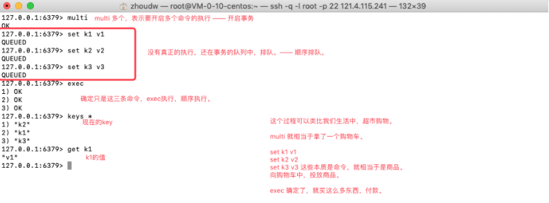
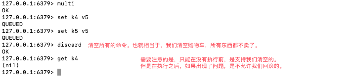
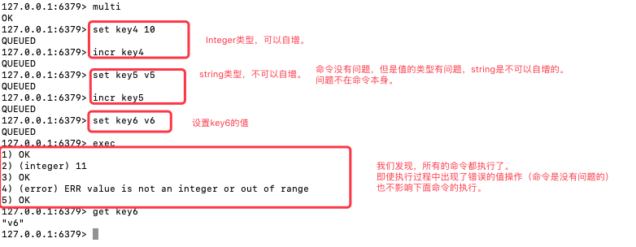
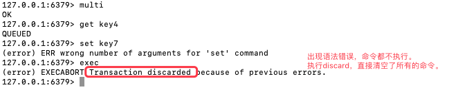
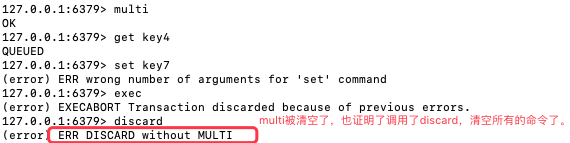
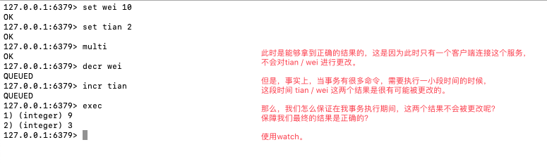
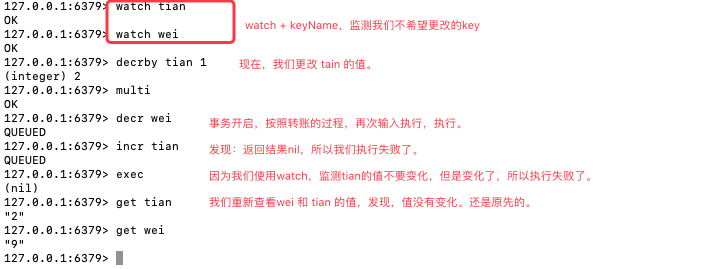
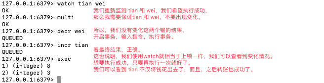

## Redis管道与事务

### 管道（pipeline）

```apl
首先，管道技术是客户端提供的，与服务器无关。通常客户端和服务端请求交互的时候，都是这样的（如下图所示）—— 发送过来一个命令，执行，返回一个结果。这样的话，我们发现，在客户端与服务端交互的过程中，大量的时间用于IO的请求传递过程、请求响应过程中。

那么我们能不能简化这个流程呢？ —— 将多个命令，一起传递给Server，类似于批处理的方式，这样至少减少了多次请求的时间。如果响应的时候也能多次一起返回回来，也就减少了响应的时间。

管道的本质，其实就是批处理。让已确定的命令，顺次发送给服务端。这样服务端也就能够顺序的处理这些命令了。（形象的说明，就是A、B两点接水，为了将B点的水杯灌满，需要从A点运水。这样就需要A->B、B->A、A->B...不断的往返。但是如果现在有一根管子，那么我们就可以通过这个管子，从A点直接将水灌入管子，通过管子直接运输到B，就不需要自己往返了。我们可以将A点看做是Client，将B点看做是Server）。

服务器始终使用，收到-执行-回复的顺序处理消息。 

而客户端通过对管道中的指令列表改变读写顺序， 而节省大幅IO时间，指令越多，效果越好。 
管道测试：redis-benchmar k （-P） 
管道可以将多个命令打包，一次性的发送给服务器端处理
```



### 事务（transaction）

```apl
一个成熟的数据库，一定要支持事务，以保障多个操作的原子性。
同时，事务还能保证一个事务中的命令依次执行 不会被其他命令插入。 

redis支持事务，但是redis只支持部分事务。首先，事务的本质是保证多个命令的原子性。还能够让一个事务中命令依次执行，不被其他命令插队。这些redis都可以支持到。
但是事务还有一个大的容错方式，就是如果有一个没有执行，那么其他的也都不能执行，可以回滚掉。这是事务的一个非常重要的特性。但是redis不支持。
redis就相当于是，我只帮你执行，出了问题你自己执行。
 
所有事务的基本用法，都是begin、commit、rollback。 
redis事务的指令是，multi、exec、discard，虽然可以使用DISCARD取消事务，但是不支持回滚。 

当输入MULTI命令后，服务器返回OK表示事务开始成功，然后依次输入需要在本次事务中执行的所有命令，每次输入一个命令服务器并不会马上执行，而是返回”QUEUED”，这表示命令已经被服务器接受并且暂时保存起来， 最后输入EXEC命令后，本次事务中的所有命令才会被依次执行。 

事务错误处理： 
					1）语法错误，全不执行。 
					 2）运行错误，出错后仍然继续执行。
```

#### 事务的指令



`流程：开启事务(multi) - 多个指令排队 - 执行事务(exec)。`





`上面这幅图，演示的是，命令没有语法错误的执行情况，是可以执行的。那么如果现在出现了语法错误，还可以执行吗？`



`总结：开启事务之后，有两种情况：1.所有指令看起来都是正常的，但是在执行过程中会有问题。在exec的时候仍然会执行，只不过哪条出错了，就给该条指令错误信息，不影响其他指令的执行。这是不回滚的明确体现。2.能够识别出语法错误，这个时候就不再执行了。直接通过调用discard，让事务清空。`



`通过上述描述，我们发现，对于管道和事务是有共同之处——都是处理多个命令的。而事务一定要处理多个命令，不然也就不用事务了。所以说，事务往往是和管道来结合使用。有很多客户端，在使用事务的时候，是要强制使用管道的。这样能够最大节省IO操作的时间。`

#### 事务监测

##### 场景模拟 

```apl
我们经常说，事务用来解决，形如转账一类的问题。需要确定，银行账户余额，一次转账，只能被改变一次。我们要保证，这一次执行的原子性，怎么保障呢？
比如说：
	我的余额是，10毛钱。
	甜的余额是，2毛钱。
	我给甜转账，1毛钱。
	---
	现在：
	我的余额：10-1=9
	甜的余额：2+1=3
	上述算数，就是我们需要获得的变化，但是要保证在变化的过程中，没有其他人再去更改。
	如果甜不知道，我给她转账，自己在这个过程中又花了1毛钱。此时余额就有变化了。
	我们要保证取到甜的余额的时候，余额没有变化。怎么办？ —— 事务提供给我们一个命令：watch（监测），监测当前值是没有变化的，然后我再拿过来改动。
```







##### 解释

```apl
将其中一条命令的执行结果作为另一条命令的执行参数，如i++，需要使用watch命令。 
WATCH命令可以监控一个或多个键，一旦其中有一个键被修改（或删除），之后的事务就不会执行，监控一直持续到EXEC命令.
执行EXEC命令之后会取消监控使用WATCH命令监控的键(实际上，在执行exec时，调用了一次unwatch)，如果不想执行事务中的命令，也可以使用UNWATCH 命令来取消监控。 

使用方式：watch -> multi -> command -> exec 

注意：由于WATCH命令的作用只是当被监控的键被修改后取消之后的事务，并不能保证其他客户端不修改监控的值，所以当EXEC命令执行失败之后需要手动重新执行整个事务。 

本质上是一种乐观锁。
```

