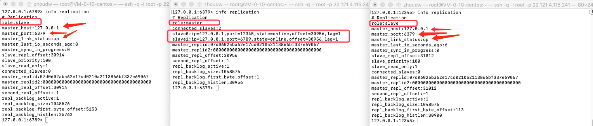
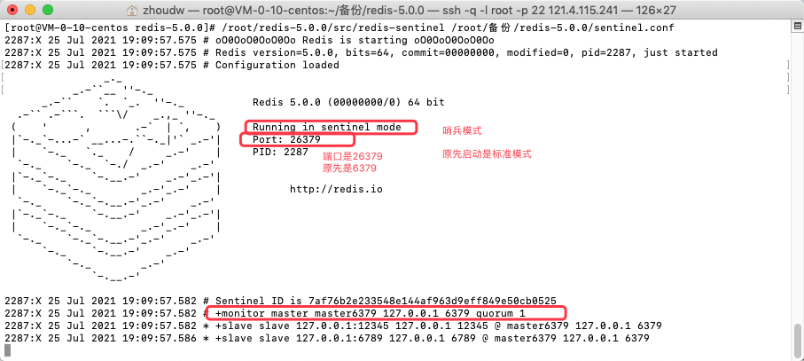

## Redis集群

 不懂运维的研发，不是好测试。我们需要对知识知识的掌握尽量的全面，才能够真的知道，怎么用、怎么规避一些问题、遇到问题怎么处理。首先在Redis的集群部署上，大部分都是集群的，至少也是有主从模式的。 在Redis的使用上，更多的集群都是运维搭建、维护的。但是，也要了解在这个过程中，怎么去配置的，出现了问题可以怎么改。往往，很多的难点问题都是要研发来解决的。

### 主从模式

```apl
当单机模式发展到一定程度的时候，没有办法支持更高的并发了，就出现了主从。主从就是一种读写分离的方式。为了保证高可用，redis-cluster集群引入了主从模式。

主从模式的设计：
* 一个主节点对应一个或者多个从节点，当主节点宕机的时候，就会启用从节点，这样保证服务平滑过渡，不至于导致服务不可用。 
* 当其它主节点 ping 一个主节点A时，如果半数以上的主节点与A通信超时，那么认为主节点A宕机了。
* 如果主节点A和它的从节点A1都宕机了，那么该集群就无法再提供服务了。
&所以我们通过这种主从模式，一方面分散服务器的压力，另一方面让服务器更加的高可用。这是分布式系统设计的一个基础概念。

优点： 
* 支持主从复制，主机会自动将数据同步到从机，可以进行读写分离；
* 为了分载Master的读操作压力，Slave服务器可以为客户端提供只读操作的服务，写服务仍然必须由Master来完成；
* Slave同样可以接受其它Slaves的连接和同步请求，这样可以有效的分载Master的同步压力。 
（Master：主服务器，Slave：从服务器）

缺点： 
* Redis不具备自动容错和恢复功能，主机从机的宕机都会导致前端部分读写请求失败，需要等待机器重启或者手动切换前端的IP才能恢复。
* 主机宕机，宕机前有部分数据未能及时同步到从机，切换IP后还会引入数据不一致的问题，降低了系统的可用性。 
* Redis较难支持在线扩容，在集群容量达到上限时在线扩容会变得很复杂。
```

#### 主从复制

```apl
* 主从模式的实现方式——主从复制。

在Redis中，用户可以通过执行SLAVEOF命令或者设置slaveof选项，让一个服务器去复制（replicate）。我们称被复制的服务器为主服务器（master），而对主服务器进行复制的服务器则被称为从服务器 （slave）。

配置的口诀为：配从不配主。 

假设现在有两个Redis服务器，地址分别为127.0.0.1:6379 和 127.0.0.1:12345，
 
如果我们向服务器 127.0.0.1:12345 发送以下命令： 
127.0.0.1:12345> SLAVEOF 127.0.0.1 6379 
OK

那么服务器127.0.0.1:12345 将成为 127.0.0.1:6379 的从服务器，而服务器127.0.0.1:6379则会成为 127.0.0.1:12345的主服务器。 
如果需要解除主从关系，输入 slaveof no one。
```

##### 流程演示

`1. 因为我们需要两个不同的redis端口，所以我们需要对配置文件进行更改，所以，我们复制redis.conf配置文件`

```bash
[root@VM-0-10-centos ~]# cd /root/备份/redis-5.0.0
[root@VM-0-10-centos redis-5.0.0]# ll
总用量 68
-rw-r--r-- 1 root root    92 7月  15 20:08 dump.rdb
-rw-r--r-- 1 root root 62155 7月  15 20:41 redis.conf
[root@VM-0-10-centos redis-5.0.0]# cp redis.conf redis_master.conf
[root@VM-0-10-centos redis-5.0.0]# cp redis.conf redis_slave.conf
[root@VM-0-10-centos redis-5.0.0]# ll
总用量 196
-rw-r--r-- 1 root root    92 7月  15 20:08 dump.rdb
-rw-r--r-- 1 root root 62155 7月  15 20:41 redis.conf
-rw-r--r-- 1 root root 62155 7月  25 10:36 redis_master.conf
-rw-r--r-- 1 root root 62155 7月  25 10:36 redis_slave.conf
```

`2. 修改配置文件，对于master而言，端口就是用默认的6379就好，因为只有一个虚拟机，我们想要做的事情是在其上启动多个redis，所以我们要区分port和pidfile，因为是master，所以我们就不需要改了，默认就好。修改一下logfile，改为master.log。修改dump文件，dbfilename改为dump_master.rdb。保存退出。`

```bash
# Accept connections on the specified port, default is 6379 (IANA #815344).
# If port 0 is specified Redis will not listen on a TCP socket.
port 6379

# If a pid file is specified, Redis writes it where specified at startup
# and removes it at exit.
#
# When the server runs non daemonized, no pid file is created if none is
# specified in the configuration. When the server is daemonized, the pid file
# is used even if not specified, defaulting to "/var/run/redis.pid".
#
# Creating a pid file is best effort: if Redis is not able to create it
# nothing bad happens, the server will start and run normally.
pidfile /var/run/redis_6379.pid

# Specify the log file name. Also the empty string can be used to force
# Redis to log on the standard output. Note that if you use standard
# output for logging but daemonize, logs will be sent to /dev/null
logfile "master.log"

# The filename where to dump the DB
dbfilename dump_master.rdb
```

`3. 修改配置文件，对于slave而言，port:12345; logfile:slave.log; dbfilename:dump_slave.rdb`

```bash
port 12345
logfile "slave.log"
dbfilename dump_slave.rdb

补充一个配置，可以指定.rdb 和 .aof 的生成路径：
# The working directory.
#
# The DB will be written inside this directory, with the filename specified
# above using the 'dbfilename' configuration directive.
#
# The Append Only File will also be created inside this directory.
#
# Note that you must specify a directory here, not a file name.
dir ./
```

`4. 通过配置文件，启动redis服务`

```bash
[root@VM-0-10-centos ~]# /root/redis-5.0.0/src/redis-server /root/备份/redis-5.0.0/redis_master.conf
[root@VM-0-10-centos ~]# /root/redis-5.0.0/src/redis-server /root/备份/redis-5.0.0/redis_slave.conf
[root@VM-0-10-centos ~]# ps -ef | grep redis
root     27790 27238  0 10:56 pts/1    00:00:00 /root/redis-5.0.0/src/redis-server 127.0.0.1:6379
root     27930 23358  0 10:56 pts/3    00:00:00 /root/redis-5.0.0/src/redis-server 127.0.0.1:12345
root     28525 28079  0 10:59 pts/4    00:00:00 grep --color=auto redis
```

`5. 连接客户端`

```bash
[root@VM-0-10-centos ~]# /root/redis-5.0.0/src/redis-cli -p 6379
127.0.0.1:6379> ping
PONG

[root@VM-0-10-centos ~]# /root/redis-5.0.0/src/redis-cli -p 12345
127.0.0.1:12345> ping
PONG

补充一个命令：info [section] 用来诊断当前redis的状态的。

127.0.0.1:6379> info Server   查看当前使用的服务端的相关信息
# Server
redis_version:5.0.0
redis_git_sha1:00000000
redis_git_dirty:0
redis_build_id:12af86b95e783a1e
redis_mode:standalone
os:Linux 3.10.0-1062.18.1.el7.x86_64 x86_64
arch_bits:64
multiplexing_api:epoll
atomicvar_api:atomic-builtin
gcc_version:4.8.5
process_id:27790
run_id:cf90e69890b2229254a0042835b9b2f1d2558ae6
tcp_port:6379
uptime_in_seconds:726
uptime_in_days:0
hz:10
configured_hz:10
lru_clock:16569757
executable:/root/redis-5.0.0/src/redis-server
config_file:/root/备份/redis-5.0.0/redis_master.conf

127.0.0.1:6379> info Clients     查看当前客户端的相关的信息
# Clients
connected_clients:1
client_recent_max_input_buffer:2
client_recent_max_output_buffer:0
blocked_clients:0


--- 端口为12345的服务端，是从服务器（slave），未设置主从时是默认是主服务器（master） ---
127.0.0.1:12345> infor replication		查看主从复制相关的信息
(error) ERR unknown command `infor`, with args beginning with: `replication`, 
127.0.0.1:12345> info replication
# Replication
role:master
connected_slaves:0
master_replid:fd715b00a86f0a55a57f72f297f06930be631af9
master_replid2:0000000000000000000000000000000000000000
master_repl_offset:0
second_repl_offset:-1
repl_backlog_active:0
repl_backlog_size:1048576
repl_backlog_first_byte_offset:0
repl_backlog_histlen:0

--- 端口为6379的服务端，是从服务器（slave），未设置主从时是默认是主服务器（master） ---
```

`6. 为将要作为主服务器的port:6379设置一些值`

```bash
127.0.0.1:6379> set key1 value1
OK
127.0.0.1:6379> set key2 value2
OK
127.0.0.1:6379> set key3 value3
OK
127.0.0.1:6379> keys *
1) "key3"
2) "key1"
3) "key2"
```

`7. 设置6379为主节点，12345为从节点`

```bash
--- 设置6379为主节点 ，使用命令 slaveof host port   host是主节点的主机地址 port是主节点的端口 ---
127.0.0.1:12345> slaveof 127.0.0.1 6379
OK

--- 查看设置后，port:12345的redis服务的状态，为slave ---
127.0.0.1:12345> info replication
# Replication
role:slave
master_host:127.0.0.1
master_port:6379
master_link_status:up  表示健康状态
master_last_io_seconds_ago:3
master_sync_in_progress:0
slave_repl_offset:5308
slave_priority:100
slave_read_only:1
connected_slaves:0
master_replid:c6e52e7cfc738b70455282a0723ac1b7dfe5eeae
master_replid2:0000000000000000000000000000000000000000
master_repl_offset:5308
second_repl_offset:-1
repl_backlog_active:1
repl_backlog_size:1048576
repl_backlog_first_byte_offset:1
repl_backlog_histlen:5308

--- 查看设置后，port:6379的redis服务的状态，为master ---
127.0.0.1:6379> info replication
# Replication
role:master
connected_slaves:1
slave0:ip=127.0.0.1,port=12345,state=online,offset=0,lag=1
master_replid:c6e52e7cfc738b70455282a0723ac1b7dfe5eeae
master_replid2:0000000000000000000000000000000000000000
master_repl_offset:14
second_repl_offset:-1
repl_backlog_active:1
repl_backlog_size:1048576
repl_backlog_first_byte_offset:1
repl_backlog_histlen:14
```

`8. 在master端，设置key-value，在slave端查看，是否同步过去了`

```bash
--- 在master端，设置key-value ---
127.0.0.1:6379> set key4 value4
OK
127.0.0.1:6379> get key4
"value4"

--- 在slave端，查看是否同步了master中新设置的键值 ---
127.0.0.1:12345> get key4
"value4"

--- 我们设置主从，是为了通过复制将主节点中的数据复制过来。现在，设置主从关系之后，master的key-value可以同步到slave端。那么，在slave端，可以查看在设置主从关系前，在master中设置的key-value吗？ ---
127.0.0.1:12345> keys *
1) "key1"
2) "key4"
3) "key2"
4) "key3"
127.0.0.1:12345> get key1
"value1"
--- 演示证明，可以拿到。其实，slave从master拉取数据的时候，是直接将所有数据都拉取过来的，并不管在哪个时间节点之后。就是，全部拉取过来。

*** 问题深究：

--- 如果我们在 slave端进行写操作，那么在master端可以显示吗？ ---
127.0.0.1:12345> set key6 value6
(error) READONLY You can't write against a read only replica.
--- 出现错误，因为主从模式是读写分离的。从节点是只读的，主节点才可以写。所以在从节点是不能够set的。-> ReadOnly


--- 如果现在主节点出现问题了，那么从节点的角色会有变化吗？会晋升成为主节点吗？ ---
--- 关闭主节点 ---
127.0.0.1:6379> shutdown
not connected> exit
--- 查看从节点状态 ---
127.0.0.1:12345> info replication
# Replication
role:slave    角色没有变化，还是slave
master_host:127.0.0.1
master_port:6379
master_link_status:down  状态从up变为了down
master_last_io_seconds_ago:-1
master_sync_in_progress:0
slave_repl_offset:5756
master_link_down_since_seconds:46
slave_priority:100
slave_read_only:1
connected_slaves:0
master_replid:c6e52e7cfc738b70455282a0723ac1b7dfe5eeae
master_replid2:0000000000000000000000000000000000000000
master_repl_offset:5756
second_repl_offset:-1
repl_backlog_active:1
repl_backlog_size:1048576
repl_backlog_first_byte_offset:1
repl_backlog_histlen:5756
--- 上述演示说明，主节点出现问题，从节点不会升级，只能乖乖等着主节点没有问题 ---

--- 如果从节点出现问题呢？ ---
--- 关闭主节点 ---
127.0.0.1:12345> shutdown
not connected> exit
--- 重新启动关闭的这个服务端，查看状态 ---
[root@VM-0-10-centos ~]# /root/redis-5.0.0/src/redis-server /root/备份/redis-5.0.0/redis_slave.conf
[root@VM-0-10-centos ~]# ./redis-5.0.0/src/redis-cli -p 12345
127.0.0.1:12345> PING
PONG
127.0.0.1:12345> info replication
# Replication
role:master  此时的身份是master
connected_slaves:0
master_replid:56bd04813218387859ac239798588bb1ed94bea0
master_replid2:0000000000000000000000000000000000000000
master_repl_offset:0
second_repl_offset:-1
repl_backlog_active:0
repl_backlog_size:1048576
repl_backlog_first_byte_offset:0
repl_backlog_histlen:0
--- 我们发现，此时的身份是master，说明，slave出现问题不回去记录以前的主从节点的状态，每次重启，都会恢复到master。如果这时候，还想让该服务成为从节点，那么需重新设置"slaveof host port"
```

##### 特点总结

```apl
1. 配从不配主。在从节点上配置 slaveof host port
2. 配了从机之后，从机是一次性，将主机上的数据给拉取过来的，会复制所有的，不管是配置前还是配置后产生的数据。在从机上都能找到。
3. 当主机不可用的时候，从机不会晋级为主机，而是在等待主机修复问题。如果主机很久无法修复，那么从机可以通过重启的方式，快速变为主节点。这样，数据是最新的，而且也成为了主节点。 
4. 从机，当前节点的角色不会保留，当重启的时候，又快速的回到了主节点。只有重新执行 slaveof host port，才会重新挂载到主节点。
5. 在从节点上不能进行write操作。
```

#### 一主二从

```bash
在早期redis的生产生活中，实际是一主二从的方式。也就是说一个master下面，有两个slave。

* 我们来模拟这个场景：

1. 复制从节点的配置文件，并修改port:6789; logfile:slave1.log; dbfilename dump_slave1.rdb .
[root@VM-0-10-centos ~]# cp /root/备份/redis-5.0.0/redis_slave.conf /root/备份/redis-5.0.0/redis_slave1.conf
[root@VM-0-10-centos ~]# vim /root/备份/redis-5.0.0/redis_slave1.conf

2. 启动服务，客户端连接。
[root@VM-0-10-centos ~]# /root/redis-5.0.0/src/redis-server /root/备份/redis-5.0.0/redis_slave1.conf
[root@VM-0-10-centos ~]# ps -ef | grep redis-server
root     16109 12458  0 12:36 pts/0    00:00:01 /root/redis-5.0.0/src/redis-server 127.0.0.1:6379
root     16818 12582  0 12:39 pts/2    00:00:01 /root/redis-5.0.0/src/redis-server 127.0.0.1:12345
root     23120 22317  0 13:10 pts/3    00:00:00 /root/redis-5.0.0/src/redis-server 127.0.0.1:6789
root     24313 23857  0 13:16 pts/8    00:00:00 grep --color=auto redis-server
[root@VM-0-10-centos ~]# /root/redis-5.0.0/src/redis-cli -p 6789

3. 现在实现的是"一主二从"，那么只要将port:6789的redis服务，也挂载到port:6379的redis服务下，就可以实现了。
127.0.0.1:6789> slaveof 127.0.0.1 6379
OK
127.0.0.1:6789> info replication
# Replication
role:slave
master_host:127.0.0.1
master_port:6379
master_link_status:up
master_last_io_seconds_ago:9
master_sync_in_progress:0
slave_repl_offset:3640
slave_priority:100
slave_read_only:1
connected_slaves:0
master_replid:07d0602aba62e17cd0210a2113866bf337e69067
master_replid2:0000000000000000000000000000000000000000
master_repl_offset:3640
second_repl_offset:-1
repl_backlog_active:1
repl_backlog_size:1048576
repl_backlog_first_byte_offset:3627
repl_backlog_histlen:14
--- 查看port:6379服务端的状态 ---
127.0.0.1:6379> info replication
# Replication
role:master
connected_slaves:2   有两个从节点了。
slave0:ip=127.0.0.1,port=12345,state=online,offset=3752,lag=0
slave1:ip=127.0.0.1,port=6789,state=online,offset=3752,lag=0
master_replid:07d0602aba62e17cd0210a2113866bf337e69067
master_replid2:0000000000000000000000000000000000000000
master_repl_offset:3752
second_repl_offset:-1
repl_backlog_active:1
repl_backlog_size:1048576
repl_backlog_first_byte_offset:1
repl_backlog_histlen:3752
```

```abap
像上述的挂载方式，是可以实现"一主二从"。
但是，将从节点都挂载到主节点上，是不是对主节点造成了极大地负担。实际上，每次都要从主节点去拷贝数据到从节点，如果挂载的越多，主节点越承担不住。
现在我们换一种方式来实现"一主二从"。
```

`1. 我们先取消挂载在master上的port:6789的redis服务`

```bash
127.0.0.1:6789> slaveof no one
OK
127.0.0.1:6789> info replication
# Replication
role:master     角色为master。
connected_slaves:0
master_replid:7d4aa6050a41a4fd2bb6b9587c318f8f4ecf294d
master_replid2:07d0602aba62e17cd0210a2113866bf337e69067
master_repl_offset:4536
second_repl_offset:4537
repl_backlog_active:1
repl_backlog_size:1048576
repl_backlog_first_byte_offset:3627
repl_backlog_histlen:910
```

`2. 我们让port:6789的redis服务，挂载到port:12345的redis服务下面（port:12345已经挂载在port:6379下了。）
port:6379 -> port:12345 -> port:6789`
`port:12345 从 port:6379 拿数据。 port:6789 从 port:12345 拿数据。 这样还是保证了三者数据的一致性。`

```bash
127.0.0.1:6789> slaveof 127.0.0.1 12345
OK
127.0.0.1:6789> info replication
# Replication
role:slave
master_host:127.0.0.1
master_port:12345
master_link_status:up
master_last_io_seconds_ago:7
master_sync_in_progress:0
slave_repl_offset:5166
slave_priority:100
slave_read_only:1
connected_slaves:0
master_replid:07d0602aba62e17cd0210a2113866bf337e69067
master_replid2:0000000000000000000000000000000000000000
master_repl_offset:5166
second_repl_offset:-1
repl_backlog_active:1
repl_backlog_size:1048576
repl_backlog_first_byte_offset:5153
repl_backlog_histlen:14
```

`3. 检验：在port:6379中set，在port:12345 & port:6789中取"`

```bash
--- 6379 ---
127.0.0.1:6379> set key7 value7
OK
--- 12345 ---
127.0.0.1:12345> get key7
"value7"
--- 6789 ---
127.0.0.1:6789> get key7
"value7"
```

```abap
这样挂载除了可以减少主节点的压力。
还有一个好处：
* 当主节点发生问题的时候，在port:12345客户端下，执行：slaveof no one。让port:12345(这个节点是直接挂载在主节点上的)变成主节点。并且，该主节点还有自己的从节点。
* 也就是，如果A后面挂载一个从节点B，B后面挂载一个从节点C，非常大的好处就是，如果A不可用了，那么B可以作为master，而且还有slave挂载在上面。这就又可以继续进行服务了。
```

#### 主从复制的原理

##### 旧版复制

我们说我们在执行slaveof host port的一瞬间，会将主库中的所有数据都同步到从库中，这个操作叫做全量同步。
后续如果主库有任何写的操作或者数据更改的命令时，从库也要感知到，这叫做增量同步。
整个复制的过程，是由全量同步和增量同步一起协作达到的效果。
对于全量同步，我们叫做同步；对于增量同步，我们叫做命令传播（是对命令修改命令的传播）。

```abap
Redis的复制功能分为同步（sync）和命令传播（command propagate）两个操作： 
同步指的是，一下子，将从库的状态更新和主库一样的状态。
命令传播指的是，把主库每次修改的命令，传播到从库中，以保证数据的一致性。
* 同步操作用于将从服务器的数据库状态更新至主服务器当前所处的数据库状态； 
* 命令传播操作则用于在主服务器的数据库状态被修改，导致主从服务器的数据库状态出现不一致时，让主从服务器的数据库重新回到一致状态。 

**同步**
当客户端向从服务器发送SLAVEOF命令，要求从服务器复制主服务器时，从服务器首先需要执行同步操作，也即是，将从服务器的数据库状态更新至主服务器当前所处的数据库状态。 
**命令传播**
在执行完同步操作之后，主从服务器之间数据库状态已经相同了。但这个状态并非一成不变，如果主服务器执行了写操作，那么主服务器的数据库状态就会修改，所以为了让主从服务器再次回到一致状态，主服务器需要对从服务器执行命令传播操作：主服务器会将自己执行的写命令，也即是造成主从服务器不一致的那条写命令，发送给从服务器执行，当从服务器执行了相同的写命令之后，主从服务器将再次回到一致状态。
```

##### 旧版复制的缺陷

```abap
在Redis中，从服务器对主服务器的复制可以分为以下两种情况： 
* 1）初次复制：从服务器以前没有复制过任何主服务器，或者从服务器当前要复制的主服务器和上一次复制的主服务器不同；
	* 此时从库要复制的就是主库全量的数据。
* 2）断线后重复制：处于命令传播阶段的主从服务器因为网络原因而中断了复制，但从服务器通过自动重连接重新连上了主服务器，并继续复制主服务器。 
	* 主库的数据量很大，还没等从库复制完，就因为某些原因中断了复制，这个时候，如果从库还要去复制主库中下的数据，就需要断线重连了。但是整体这个过程（即，SYNC命令是一个非常耗费资源的操作）是很消耗资源的，因为它首先要保障主库有一个最新的数据文件，这个文件就是rdb,就是我们下面的过程了（每次执行SYNC命令，都需要执行如下流程）：
* 1）主服务器需要执行BGSAVE命令来生成RDB文件，这个生成操作会耗费主服务器大量的CPU、内存和磁盘I/O资源；
* 2）主服务器需要将自己生成的RDB文件发送给从服务器，这个发送操作会耗费主从服务器大量的网络资源（带宽和流量），并对主服务器响应命令请求的时间产生影响； 
* 3）接收到RDB文件的从服务器需要载入主服务器发来的RDB文件，并且在载入期间，从服务器会因为阻塞而没办法处理命令请求。
```


##### 新版复制

```abap
Redis从2.8版本开始，使用PSYNC命令代替SYNC命令来执行复制时的同步操作。 
PSYNC命令具有完整重同步（full resynchronization）和部分重同步（partial resynchronization）两种模式： 

* 完整重同步用于处理初次复制情况：完整重同步的执行步骤和SYNC命令的执行步骤基本一样，它们都是通过让主服务器创建 并发送RDB文件，以及向从服务器发送保存在缓冲区里面的写命令来进行同步； 
* 部分重同步则用于处理断线后重复制情况：当从服务器在断线后重新连接主服务器时，如果条件允许，主服务器可以将主从服务器连接断开期间执行的写命令发送给从服务器，从服务器只要接收并执行这些写命令，就可以将数据库更新至主服务器当前所处的状态。

部分重同步的实现，由以下三个部分构成： 
* 1）主服务器的复制偏移量（replication offset）和从服务器的复制偏移量； 
* 2）主服务器的复制积压缓冲区（replication backlog）； 
* 3）服务器的运行ID（run ID）。
```

### 哨兵模式

主从模式帮助我们解决了什么问题呢？首先 ，帮助我们分担了高并发问题；另外，能做读写分离；而且，当主库宕机，从库还有备份的功能。如果，半夜主库挂了，怎么办？运维要加班加点工作了——把从库重新设置为主库，在通知所有的程序，将地址统统改一遍重新上线。显然，不可行。这样人工运维的成本太高了。那么我们能不能有一个高可用，智能化的解决方案：可以自动的识别出什么时候主库出了问题，并选出（投票算法）一个从库作为主库来替代原先的主库。这种实时的监测，像放哨一样监测服务状态的模式，称为哨兵模式。它是主从模式的进阶版，也是很多公司当前使用的一种集群模式。

#### 概念

```apl
当主服务器中断服务后，可以将一个从服务器升级为主服务器，以便继续提供服务，但是这个过程需要人工手动来操作。 
为此，Redis 2.8 中提供了哨兵工具来实现自动化的系统监控和故障恢复功能。 

哨兵的作用就是监控Redis系统的运行状况。它的功能包括以下两个。 
*（1）监控主服务器和从服务器是否正常运行。 
*（2）主服务器出现故障时自动将从服务器转换为主服务器。 

哨兵模式的优缺点 
优点：哨兵模式是基于主从模式的，所有主从的优点，哨兵模式都具有。
主从可以自动切换，系统更健壮，可用性 更高。 
缺点：Redis较难支持在线扩容，在集群容量达到上限时在线扩容会变得很复杂。
```

#### 哨兵模式的使用

```bash
[root@VM-0-10-centos ~]# ll /root/redis-5.0.0/src | grep redis
-rw-rw-r-- 1 root root    2418 10月 17 2018 redisassert.h
-rwxr-xr-x 1 root root 4366552 7月   4 09:04 redis-benchmark
-rw-rw-r-- 1 root root   29605 10月 17 2018 redis-benchmark.c
-rw-r--r-- 1 root root  109120 7月   4 09:04 redis-benchmark.o
-rwxr-xr-x 1 root root 8082696 7月   4 09:04 redis-check-aof
-rw-rw-r-- 1 root root    7143 10月 17 2018 redis-check-aof.c
-rw-r--r-- 1 root root   28776 7月   4 09:04 redis-check-aof.o
-rwxr-xr-x 1 root root 8082696 7月   4 09:04 redis-check-rdb
-rw-rw-r-- 1 root root   13541 10月 17 2018 redis-check-rdb.c
-rw-r--r-- 1 root root   65896 7月   4 09:04 redis-check-rdb.o
-rwxr-xr-x 1 root root 4783456 7月   4 09:04 redis-cli
-rw-rw-r-- 1 root root  249486 10月 17 2018 redis-cli.c
-rw-r--r-- 1 root root  871072 7月   4 09:04 redis-cli.o
-rw-rw-r-- 1 root root   29044 10月 17 2018 redismodule.h
-rwxr-xr-x 1 root root 8082696 7月   4 09:04 redis-sentinel
-rwxr-xr-x 1 root root 8082696 7月   4 09:04 redis-server
-rwxrwxr-x 1 root root    3600 10月 17 2018 redis-trib.rb

* redis-sentinel就是我们redis提供给我们的小哨兵——监控工具。
```

##### 使用步骤

```apl
新建sentinel. conf文件 文件内容填写如下： 
sentinel monitor master6379 127.0.0.1 6379 1
sentinel 哨兵
monitor 监控、监测
master6379 redis数据库名字（自定义的，需要一个数据库名称）
127.0.0.1 监测的数据库的主机地址
6379 监测的数据库的端口
1 如果6379这个主机挂掉了，那么开始投票选取，当票数大于 1 ，让从库变为主库。

启动哨兵工具： redis-sentinel /root/备份/redis-5.0.0/sentinel.conf 

一组sentinel能同时监控多个Master 
```


`1. 环境：使用port:6379作为主库，port:12345 & port:6789作为从库，将两个从库都挂载到主库上`



`2.想要使用哨兵为我们监测，需要一个配置文件`

```bash
[root@VM-0-10-centos redis-5.0.0]# vim /root/备份/redis-5.0.0/sentinel.conf

sentinel monitor master6379 127.0.0.1 6379 1
~                                                                                    
~                                                                                             
:wq 
```

`3. 使用配置文件，执行redis-sentinel`

```bash
[root@VM-0-10-centos redis-5.0.0]# /root/redis-5.0.0/src/redis-sentinel /root/备份/redis-5.0.0/sentinel.conf

我们观察启动日志，就会发现，现在启动的模式是：sentinel mode。此时的端口号是26379
```



`4. 模拟主库出现情况的时候`

```apl
我们在 port:6379所在客户端进行，shutdown操作。
然后我们稍等，哨兵给出作为，因为哨兵是按照时间轮询的，所以执行完该命令后稍等。

127.0.0.1:6379> shutdown
not connected> exit

* 然后开始选举新的主库，并且从库会自动挂载到选中的主库上。

问题：当前master出现问题，更换master了，那么，如果之前的master重启回来，会如何分配角色？ 
* 我们重新启动port:6379的服务端，然后发现，查看该服务的身份信息为slave。
* 实际上，修复好的master，身份将是挂载到新主库上的从库而已。
```


