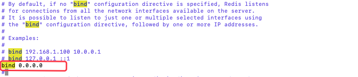

### 客户端使用配置

前面那么多篇，我们都是在服务器或者虚拟机上，通过命令来操作Redis的，这种方式是直接和Redis打交道的。但是在真实的项目中，不可能像这样的，我们只能通过代码来调用Redis。这样也能支持的功能更丰富。通过代码来调用Redis，实际上就是使用了Redis客户端。

这种客户端有，Jedis、Redisson、Lettuce等等。比较常用的是Jedis，我们也将着重了解这个客户端。

在我们测试、学习的时候，我们要让我们本机的ＩＤＥ去连接远程的服务器，或者本机的虚拟机的Redis。我们需要做一件非常重要的事情，修改redis配置文件。

我们在上面介绍配置文件的时候，说到过： `bind`，是用来制约客户端访问过来的IP地址的。如果默认原先的127.0.0.1，那么此时这个服务端只能本机来访问。现在我想从本机去访问虚拟机或者远程的服务器，其实是有外网地址来访问了，这个时候我们配置 `bind 0.0.0.0`   代表任何机器都能来访问这个服务端。我们只是测试用，实际生产中，是不这么用的。



执行完上述流程之后，我们还需要执行一个命令，这个命令是为了保障我们的虚拟机或者服务器的防火墙是打开的，命令如下：
`/sbin/iptables -I INPUT -p tcp --dport 6379 -j ACCEPT `
这个命令，执行iptables的修改，确保这个虚拟机或者服务器上的端口6379能够被正常的访问到。


现在要注意虚拟机或者服务器的IP地址了，因为需要通过访问这个IP下，6379端口，拿到redis服务。

**由于我使用的是远程的服务器，所以这里补充一下如何使用Jedis连接远程的Redis**

`1. 修改服务器提供商的安全组规则，开放6379端口（声明，本人使用的是腾讯云）`


`2. 修改服务器的防火墙规则，开放6379端口（执行效果如下）`

```bash
[root@VM-0-10-centos ~]# systemctl start firewalld
[root@VM-0-10-centos ~]# systemctl status firewalld
● firewalld.service - firewalld - dynamic firewall daemon
   Loaded: loaded (/usr/lib/systemd/system/firewalld.service; disabled; vendor preset: enabled)
   Active: active (running) since 一 2021-07-26 08:30:35 CST; 14s ago   
     Docs: man:firewalld(1)
 Main PID: 16326 (firewalld)
   CGroup: /system.slice/firewalld.service
           └─16326 /usr/bin/python2 -Es /usr/sbin/firewalld --nofork --nopid

7月 26 08:30:33 VM-0-10-centos systemd[1]: Starting firewalld - dynamic fir....
7月 26 08:30:35 VM-0-10-centos systemd[1]: Started firewalld - dynamic fire....
7月 26 08:30:35 VM-0-10-centos firewalld[16326]: WARNING: AllowZoneDrifting ...
Hint: Some lines were ellipsized, use -l to show in full.

Active: active (running) ... 防火墙处于开启状态，执行如下命令：
//查看防火墙状态 
               firewall-cmd --state
//开放6379端口  
               firewall-cmd --permanent --add-port=6379/tcp
//查看端口，执行 
               firewall-cmd --permanent --query-port=6379/tcp
               firewall-cmd --permanent --list-ports
//重启防火墙
               firewall-cmd --reload
               
[root@VM-0-10-centos ~]# firewall-cmd --state
running
[root@VM-0-10-centos ~]# firewall-cmd --permanent --add-port=6379/tcp
Warning: ALREADY_ENABLED: 6379:tcp
success
[root@VM-0-10-centos ~]# firewall-cmd --permanent --query-port=6379/tcp
yes
[root@VM-0-10-centos ~]# firewall-cmd --permanent --list-ports
20/tcp 21/tcp 22/tcp 80/tcp 8888/tcp 39000-40000/tcp 888/tcp 6379/tcp
[root@VM-0-10-centos ~]# firewall-cmd --reload
success
```

`3.修改Redis配置文件`

```bash
1. protected-mode改为no
# Protected mode is a layer of security protection, in order to avoid that
# Redis instances left open on the internet are accessed and exploited.
#
# When protected mode is on and if:
#
# 1) The server is not binding explicitly to a set of addresses using the
#    "bind" directive.
# 2) No password is configured.
#
# The server only accepts connections from clients connecting from the
# IPv4 and IPv6 loopback addresses 127.0.0.1 and ::1, and from Unix domain
# sockets.
#
# By default protected mode is enabled. You should disable it only if
# you are sure you want clients from other hosts to connect to Redis
# even if no authentication is configured, nor a specific set of interfaces
# are explicitly listed using the "bind" directive.
protected-mode no

2. 注释掉bind
# By default, if no "bind" configuration directive is specified, Redis listens
# for connections from all the network interfaces available on the server.
# It is possible to listen to just one or multiple selected interfaces using
# the "bind" configuration directive, followed by one or more IP addresses.
#
# Examples:
#
# bind 192.168.1.100 10.0.0.1
# bind 127.0.0.1 ::1
#
# ~~~ WARNING ~~~ If the computer running Redis is directly exposed to the
# internet, binding to all the interfaces is dangerous and will expose the
# instance to everybody on the internet. So by default we uncomment the
# following bind directive, that will force Redis to listen only into
# the IPv4 loopback interface address (this means Redis will be able to
# accept connections only from clients running into the same computer it
# is running).
#
# IF YOU ARE SURE YOU WANT YOUR INSTANCE TO LISTEN TO ALL THE INTERFACES
# JUST COMMENT THE FOLLOWING LINE.
# ~~~~~~~~~~~~~~~~~~~~~~~~~~~~~~~~~~~~~~~~~~~~~~~~~~~~~~~~~~~~~~~~~~~~~~~~
#bind 127.0.0.1

3. 设置密码
# Require clients to issue AUTH <PASSWORD> before processing any other
# commands.  This might be useful in environments in which you do not trust
# others with access to the host running redis-server.
#
# This should stay commented out for backward compatibility and because most
# people do not need auth (e.g. they run their own servers).
#
# Warning: since Redis is pretty fast an outside user can try up to
# 150k passwords per second against a good box. This means that you should
# use a very strong password otherwise it will be very easy to break.
#
# requirepass foobared
requirepass tian_sha
```

`3. 通过配置文件启动，并查看当前进程`

```bash
[root@VM-0-10-centos ~]# /root/redis-5.0.0/src/redis-server /root/备份/redis-5.0.0/redis.conf

[root@VM-0-10-centos ~]# ps -ef | grep redis
root     25053 16138  0 09:03 pts/0    00:00:00 /root/redis-5.0.0/src/redis-server *:6379
root     25443 25129  0 09:05 pts/1    00:00:00 grep --color=auto redis
```

`4. 导入jedis依赖 、 引入jar包，编写测试代码`

```java
package cn.zhoudbw;

import redis.clients.jedis.Jedis;

/**
 * 直接写主方法，演示Jedis的使用了，说明都在注释里了。
 *
 * @author zhoudbw
 */
public class JedisTest {

    public static void main(String[] args) {

        Jedis jedis = new Jedis("服务器IP", 6379);// 通过Jedis(主机IP, 端口号)的构造方法初始化Redis对象
        jedis.auth("password-yourself");// 授权
        System.out.println(jedis.ping());// 测试连接

        // 创建时就要想到关闭（建议优先写上这句话，然后再去写具体逻辑）
        jedis.close();
    }
}
--- 运行结果 ---
PONG

Process finished with exit code 0
```


### Jedis使用

首先，我要是用的客户端是Jedis。Redis的各种语言客户端列表，请参见https://redis.io/clients。其中Java客户端在github上star最高的是Jedis和Redisson。Jedis提供了完整Redis命令，而Redisson有更多分布式的容器实现。 我们就说Jedis。

```xml
<!-- https://mvnrepository.com/artifact/redis.clients/jedis -->
<dependency>
    <groupId>redis.clients</groupId>
    <artifactId>jedis</artifactId>
    <version>3.2.0</version>
</dependency>
```

Java代码的编写

#### 基础使用（就和Redis的命令一样）

```java
package cn.zhoudbw;

import redis.clients.jedis.Jedis;
import redis.clients.jedis.SortingParams;

import java.util.List;
import java.util.Set;

/**
 * 直接写主方法，演示Jedis的使用了，说明都在注释里了。
 *
 * @author zhoudbw
 */
public class JedisTest {

    public static void main(String[] args) {
        Jedis jedis = new Jedis("服务器IP", 6379);
        jedis.auth("password-yourself");

//        System.out.println(jedis.ping());// 测试连接

        /** 具体逻辑 */
        String key = "jedis";
        // 判断 key 是否存在，如果存在就删除这个key，重新设置；如果不存在，直接设置（常用命令）
        System.out.println("key == jedis的结果：" + jedis.exists(key));
        if (jedis.exists(key)) {
            System.out.println("说明存在，删除");
            jedis.del(key);
        }
        System.out.println("创建key=jedis");
        jedis.set(key, "hello");// set key value
        System.out.println("set => key: jedis, value:" + jedis.get(key));// get key
        jedis.expire(key, 100);// 设置key的有限期为100秒
        try {
            Thread.sleep(1000);// 等待1秒
            System.out.println("休眠 1 秒");
        } catch (Exception e) {
        }
        System.out.println(key + "的剩余有效期为, " + jedis.ttl(key));

        //  setnx("jedis2", "hello2") => 判断key2是否存在，如果不存在就创建，如果存在就算了（重要命令）
        jedis.setnx("jedis2", "hello2");
        System.out.println("setnx => key:jedis2, value:" + jedis.get("jedis2"));

        // 打印现在所有的key（键值命令）
        Set set = jedis.keys("*");
        System.out.println("当前服务端存储的键有：" + set);

        // 非字符串结构的命令——字符串举例
        jedis.lpush("list1", "tian", "wei");// 创建一个列表
        List list = jedis.lrange("list1", 0, -1);
        System.out.println("遍历列表list1:" + list);

        // 排序命令 sort + key 如果不传递排序方式，默认是从小到大排序，传递alpha设置为按照字母排序
        SortingParams params = new SortingParams();
        System.out.println(jedis.sort("list1", params.alpha()));

        // 创建时就要想到关闭（建议优先写上这句话，然后再去写具体逻辑）
        jedis.close();
    }
}
```

#### 管道的使用

```java
package cn.zhoudbw;

import redis.clients.jedis.Jedis;
import redis.clients.jedis.Pipeline;

/**
 * 管道是客户端的技术，这个类演示管道的相关操作
 * 管道：统一的存储多个命令，统一执行。
 * 不需要一条一条的传递给服务端，一次性传递给客户端。
 *
 * @author zhoudbw
 */
public class JedisPipeTest {

    public static void main(String[] args) {
        Jedis jedis = new Jedis("服务器IP", 6379);
        jedis.auth("password-yourself");

        String key = "pipe1";
        jedis.set(key, "10");//如果我们想要设置Integer的话，还是需要用双引号引起来，因为Redis不支持单独的数据类型，只支持字符串
        // 使用管道
        Pipeline pipeline = jedis.pipelined();
        // 自增十次的操作，注意，不能通过jedis调用了，因为现在使用的管道技术
        // 这里实际上是将命令存入给管道了，还没有统一提交
        for (int i = 0; i < 10; i++) {
            pipeline.incr(key);
        }
        // 统一提交
        pipeline.sync();
        System.out.println(jedis.get(key));
        jedis.close();
    }
}
```

#### 事务的演示

```java
package cn.zhoudbw;

import redis.clients.jedis.Jedis;
import redis.clients.jedis.Transaction;

import java.util.List;

/**
 * Redis的事务测试类
 *
 * @author zhoudbw
 */
public class JedisTransTest {
    public static void main(String[] args) {
        Jedis jedis = new Jedis("服务器IP", 6379);
        jedis.auth("password-yourself");

        // 还是模拟wei给tian转账
        jedis.set("tian", "9");// 假设，tian有18元
        jedis.set("wei", "99");// 假设，wei有99元

        // watch监测，这样在真正执行事务的时候，会校验，在事务执行之前和事务执行的时候，value是否一致，
        // 以防有其他的线程，或者其他的客户端，将其篡改了，导致数据不一致。
        jedis.watch("wei", "tian");

        // wei 给 tian 转账 66 元 （这样我们两的余额就变化了）
        // 如何通过事务来实现?
        /* 严谨点，判断是否足够转出 */
        if (Integer.parseInt(jedis.get("wei")) >= 66) {
            Transaction transaction = jedis.multi();// 开启事务
            transaction.decrBy("wei", 66);// wei转给tian，wei少了
            transaction.incrBy("tian", 66);// wei转给tian，tian多了
            /* 如果不想执行了上述命令了，调用transaction.discard() */
            transaction.exec();// 执行事务
        }
        // 验证结果（批量获取key的命令）
        List list = jedis.mget("wei", "tian");
        System.out.println("当前两者余额，wei-" + list.get(0) + ", tian-" + list.get(1));
				jedis.close();
    }
}
```

### JedisPool

我们上面的操作，使用Redis都是需要的时候创建，不需要的时候关闭。显然这种使用很不友好。我们回想，我们使用数据库的时候，就是通过连接池将连接统一的管理起来，这样也避免了，每次使用都去创建，然后关闭，对于资源的浪费。基于同样的考虑Jedis也有自己的连接池——JedisPool。

Jedis对象并不是线程安全的。为了避免每次使用Jedis对象时都需要重新构建，Jedis提供了JedisPool。 JedisPool是基于Commons Pool 2实现的一个线程安全的连接池。

如果使用jar包，需要特别注意所需的jar包，我使用的：
`jedis-3.2.0.jar + commons-pool2-2.9.0.jar + slf4j-api-1.7.9`
同时，注意jar包版本不同会导致出现JedisPoolConfig中没有SetMaxTotal(),setMaxIdle()等方法。

```java
package cn.zhoudbw;

import redis.clients.jedis.Jedis;
import redis.clients.jedis.JedisPool;
import redis.clients.jedis.JedisPoolConfig;

/**
 * JedisPool获取Jedis连接
 *
 * @author zhoudbw
 */
public class JedisPoolTest {
    public static void main(String[] args) {
        // 首先创建JedisPool的配置
        JedisPoolConfig config = new JedisPoolConfig();
        // 设置Jedis的最大连接数
        config.setMaxTotal(10);
        // 通过配置，IP，端口创建JedisPool
        JedisPool pool = new JedisPool(config, "服务器IP", 6379);

        // 通过JedisPool拿Jedis
        Jedis jedis = null;
        try {
            // 拿出一个可用的连接
            jedis = pool.getResource();
            // 授权
            jedis.auth("password-yourself");

            jedis.set("tian", "sha");
            System.out.println("tian " + jedis.get("tian"));
        } catch (Exception e) {
        } finally {
            if (jedis != null) {
                // 释放连接，放回池子中
                jedis.close();
            }
        }
        // 关闭JedisPool
        pool.close();
    }
}
```

